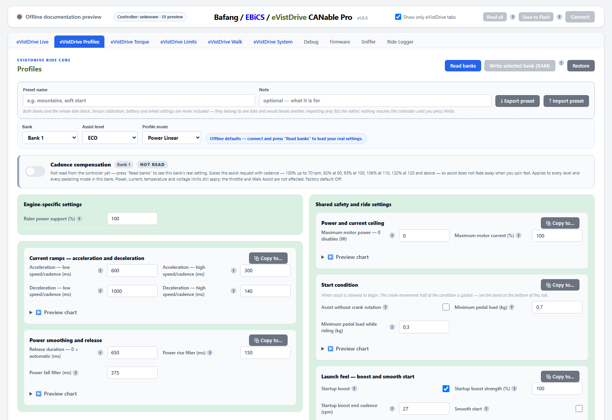
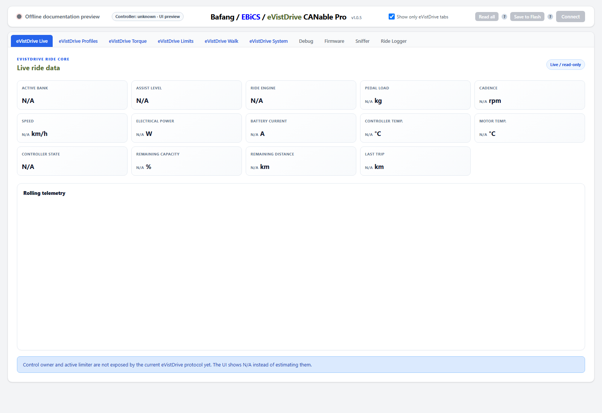
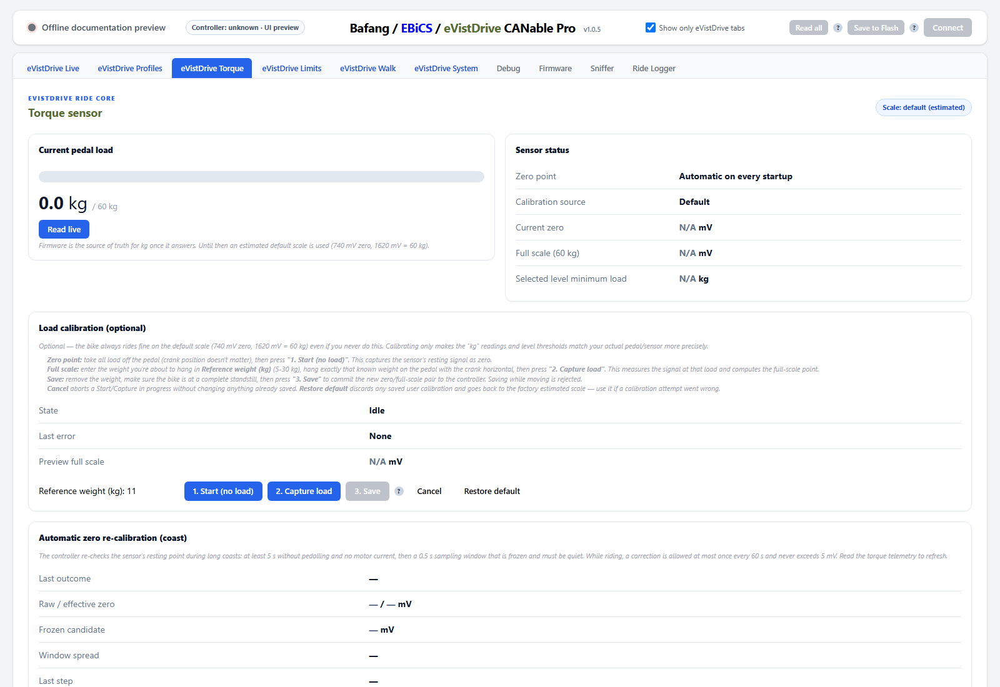
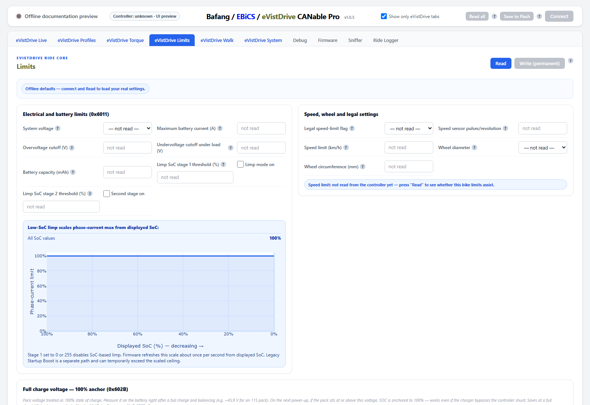
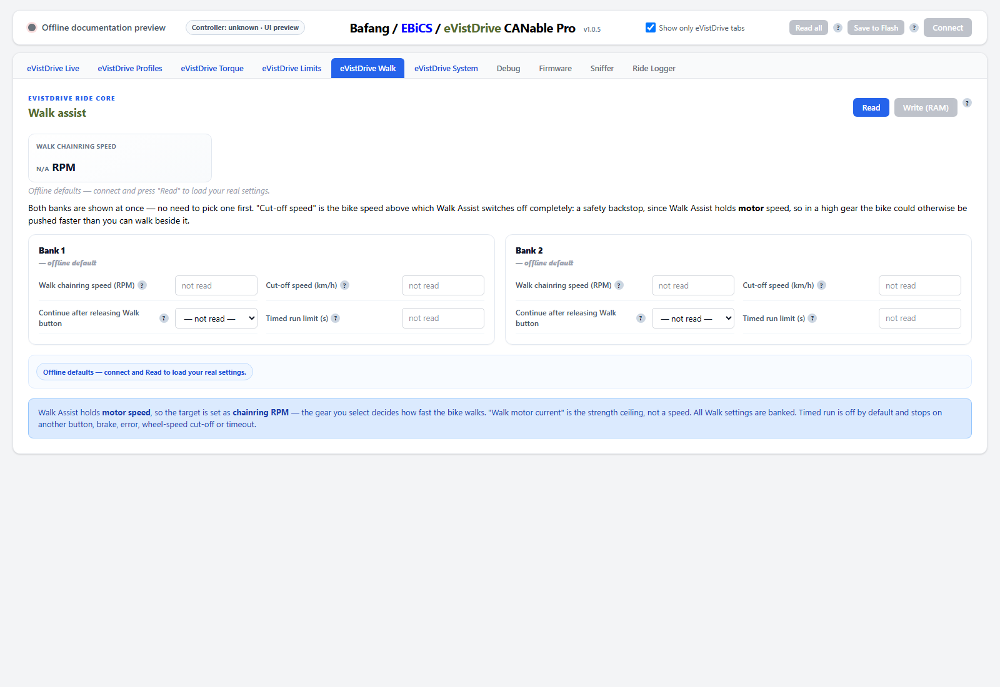
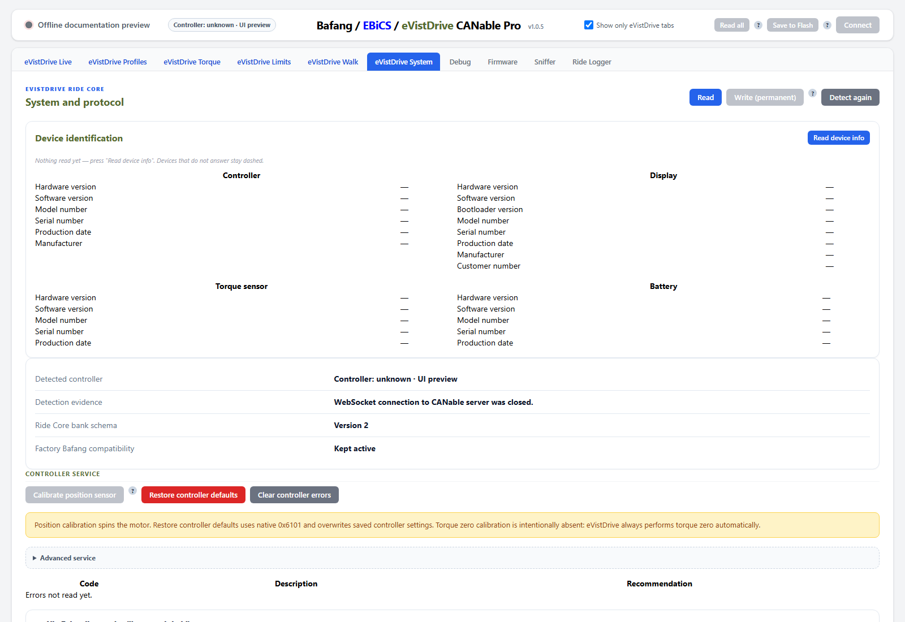

# eVistDrive Firmware

**eVistDrive** is an open-source torque-sensing e-bike motor control platform. This repository holds the motor controller firmware for the hubmotor controller CRA101C with the GD32F303RCT6 processor.

**Tested hardware:** this firmware has only been run and verified on the **first hardware revision of the Bafang M820** controller. No other M820 revision, and no other controller (M510, M560, etc.), has been tested with this fork — support for those may be added in the future, but do not assume it works today.

eVistDrive combines the proven motor control architecture of **[EBiCS](https://github.com/EBiCS/BAFANG_GD32F303RCT6)** with rider-assistance concepts inspired by the open-source **[TSDZ2-Smart-EBike](https://github.com/emmebrusa/TSDZ2-Smart-EBike-1)** firmware project. It is an independent open-source fork — **not** an official product of the original EBiCS or TSDZ developers.

> eVistDrive is derived from the EBiCS motor controller firmware and incorporates concepts inspired by open-source TSDZ firmware projects. Original copyright notices and licenses are preserved.

This project is under construction. All you are doing with this project is on your own risk. The authors do not accept any liability for damage to property or personal injury!  
It is strongly recommented to use a fuse between controller and battery.

**New here? See [QUICKSTART.md](QUICKSTART.md) for flashing and the minimum setup before riding.**

**Configuration requires the matching CANable tool from this project's own fork: [glodnickim/bafang_canable_pro](https://github.com/glodnickim/bafang_canable_pro).** This is not an optional alternative — this firmware's CAN protocol has been extended (additional fields, newer bank blob versions) beyond the original EBiCS protocol, so an unmodified/other CANable build will not understand every parameter this firmware exposes.

## CANable configuration interface

The matching CANable build detects eVistDrive firmware and exposes six dedicated Ride Core tabs. The screenshots below use its offline documentation preview, so `N/A`, `not read` and disabled write buttons are intentional; connecting the controller and pressing **Read** loads the bike's real values.

### Profiles

Configure both banks and all five assist levels: ride mode, support, power/current ceilings, pedal-load start conditions in kg, startup boost, response ramps, smoothing, cadence compensation, preview charts and shareable presets.

### Live

Monitor the active bank and level together with pedal load, cadence, speed, electrical power, current, temperatures, battery state, range and rolling telemetry.

### Torque

Inspect pedal load in kg, the automatic zero point, optional loaded calibration and detailed coast re-zero diagnostics.

### Limits

Set electrical, battery, speed, wheel and legal limits, review low-SoC current scaling and configure the full-charge voltage used as the 100% SOC anchor.

### Walk

Edit both profile banks side by side: target chainring RPM, wheel-speed cut-off and optional timed operation after releasing the Walk button.

### System

Read device identities and firmware information, detect the controller family, inspect faults and diagnostics, run position-sensor calibration and access protected service actions.

This program is free software: you can redistribute it and/or modify it under the terms of the GNU General Public License as published by the Free Software Foundation, either version 3 of the License, or (at your option) any later version.
