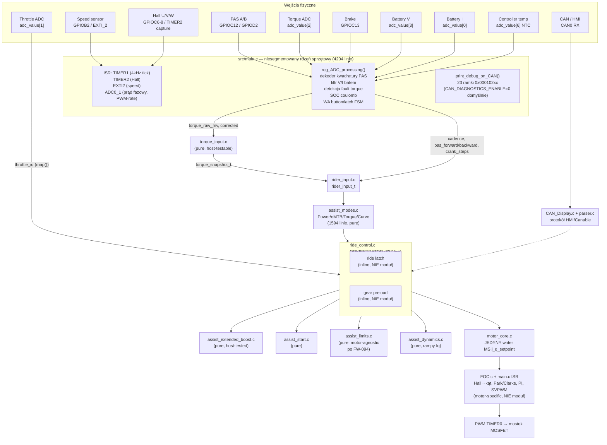

# Audyt architektury firmware eVistDrive (BAFANG_GD32F303RCT6) — gotowość pod wiele silników, dokumentację i testy

Data audytu: 2026-08-10. Build w chwili audytu: **0.0329** (`inc/build_version.h`), gałąź `master`,
HEAD lokalnie 1 commit przed `origin/master` (`1544793`), z niezacommitowanymi zmianami w
`inc/config.h`, `inc/ride_control.h`, `src/main.c`, `src/ride_control.c` oraz nowymi,
niedodanymi plikami `pas_trace.*`, `ride_episode.*` i ich testami hosta (praca nad FW-101).

**Status: WYŁĄCZNIE AUDYT.** Nie zmieniono żadnego pliku produkcyjnego. Ten dokument jest
jedynym artefaktem utworzonym w ramach tego zadania.

**Zakres, którego NIE dało się w pełni zweryfikować:** aplikacja Canable/eVistDrive UI
(`c:/Projekty/bafang_canable_pro`) była przeglądana tylko powierzchownie (inwentaryzacja
testów JS), bo zadanie dotyczy repozytorium firmware. Tam, gdzie wniosek opiera się na
działaniu UI/protokołu po drugiej stronie CAN, jest to zaznaczone jako niepewność.

---

## 1. Executive summary

EVistDrive to fork firmware Bafang M820 (GD32F30x, rdzeń Cortex-M4), w trakcie **aktywnego,
zdyscyplinowanego refaktoru** od monolitu w stylu vendor-BMS ku modularnemu "ride core". To
NIE jest projekt, który dopiero trzeba zacząć porządkować — jest w połowie drogi, i ta połowa
jest zrobiona dobrze:

- 15 z ~19 modułów logiki jazdy (`torque_input`, `rider_input`, `assist_modes`, `assist_start`,
  `assist_dynamics`, `assist_limits`, `assist_extended_boost`, `motor_core`, `cadence_comp`,
  `tuning_config`, `power_curve`, `level_gesture`, `walk_assist_motor`,
  `walk_speed_controller`, `pas_trace`, `ride_episode`) mają już **czyste API wejście-struct
  → wyjście-struct**, zero zależności od globali `MS`/`MP` i zero zależności sprzętowej.
  Trzy z nich (`assist_extended_boost`, `ride_episode`, `pas_trace`) mają już testy hosta
  (`tests/host/*.c`), które kompilują i uruchamiają **te same pliki `.c`, które trafiają do
  firmware** — nie reimplementację w innym języku.
- Pozostał jeden duży, nierozbity węzeł: **`src/main.c` — 4204 linie**, w którym mieszkają:
  cała inicjalizacja sprzętu, wszystkie ISR, dekoder kwadratury PAS, odczyt ADC (torque,
  throttle, bateria, temperatura), Hall/kąt elektryczny, SOC/coulomb counting, zapis EEPROM,
  23 ramki diagnostyczne CAN (`print_debug_on_CAN`, ~635 linii) i pętla główna, która spina to
  wszystko w jeden ciąg wywołań.
- Granica między logiką jazdy a warstwą silnika **istnieje i w większości działa** —
  `motor_core.c` jest jedynym miejscem, które zapisuje `MS.i_q_setpoint`/`i_d_setpoint`
  (zweryfikowane grepem), a `assist_limits.h` explicite deklaruje się jako "motor-agnostic"
  po tym, jak przestał zależeć od `main.h` (FW-094). Ale warstwa faktycznie
  motor-specyficzna (Hall, FOC, PWM, dynamiczny wybór fazy do odczytu ADC) NIE ma własnego
  modułu — leży rozproszona między `main.c` i `FOC.c`, połączona globalami bez interfejsu.
- Najpoważniejsze, w pełni potwierdzone znalezisko tego audytu (**F1**, sekcja 21) to **systemowa
  niespójność bazy czasu**: karty FW-103/FW-104 poprawiły dokładnie ten sam błąd (licznik
  "tick" zliczający wywołania funkcji zamiast realnych okresów sprzętowych 4 kHz) — ale
  wyłącznie dla prędkości i `ride_episode`. Dokładnie ten sam wzorzec błędu wciąż istnieje
  w kilkunastu innych licznikach w `main.c` i modułach ride core (debounce błędu torque,
  timeout PAS, timery Extended Boost, watchdog auto-off, sub-liczniki CAN). FW-104 sam
  dostarczył dowodu, że pominięcia ticków REALNIE się zdarzają (`missed_control_ticks`,
  komentarz: "the CAN diagnostic frames alone can do that").
- Dokumentacja jest **spójna i wysokiej jakości tam, gdzie istnieje**, ale wyraźnie w tyle za
  kodem: najnowszy wpis w `CHANGELOG.md` to FW-095, podczas gdy w drzewie źródeł żyją już
  karty FW-096 do FW-104 (w tym cały mechanizm FW-101-104 opisany wyłącznie w komentarzach
  kodu i w plikach testowych).
- Testy: trzy najnowsze moduły diagnostyczne mają wzorowe testy hosta uruchamiające
  prawdziwy kod C. Reszta pokrycia w repo to **testy JS re-implementujące logikę C** (czytają
  kod C jako tekst, nie jako wykonywalny artefakt) — świadomie nazwane przez samych autorów
  jako niewystarczające (`FW-084_AUDIT_DEVELOPER_HANDOFF.md`).

**Odpowiedź w jednym zdaniu na pytanie z briefu:** kod NIE jest dziś podzielony tak, jak
docelowo powinien być, ale podział, który już istnieje, jest zbudowany dokładnie w dobrym
miejscu (na granicy `rider_input_t` → `ride_control` → `motor_command_t`) i etapowe dojście do
architektury motor-agnostycznej jest realne bez big-bang rewrite.

---

## 2. Aktualna architektura — mapa pod lotem ptaka



Dwie rzeczy widać na tym diagramie od razu:

1. Od `rider_input_t` do `motor_command_t` łańcuch jest już czysty i jednokierunkowy —
   dokładnie tak, jak powinien wyglądać docelowo silnik jazdy motor-agnostyczny.
2. Wszystko PRZED `rider_input_t` (dekodowanie sygnałów fizycznych) i WSZYSTKO PO
   `motor_command_t` (FOC/Hall/PWM) wciąż żyje w jednym pliku `main.c` plus `FOC.c`, bez
   wydzielonych granic modułów.

---

## 3. Kompletny tor danych end-to-end (wejście fizyczne → sterowanie silnikiem)

Tabela w kolejności przepływu. Kolumna "Motor-agn." mówi, czy dany element w obecnym kodzie
JEST już motor-agnostyczny (nie wymaga zmian przy zmianie silnika), czy jest specyficzny dla
M820 (Bafang, GD32F303, ten dokładny hardware).

| # | Element | Plik:funkcja | Wejścia | Wyjścia | Stan wewn. | Timebase | Motor-agn.? |
|---|---|---|---|---|---|---|---|
| 1 | ISR zegara sterowania | `main.c:1553` `TIMER1_IRQHandler` | timer HW | `control_time_ticks++`, `reg_ADC_flag=1` | 2 globale | 4 kHz sprzętowo (TIMER1, `CONTROL_TIMEBASE_HZ`) | Tak (nazwa stałej, nie treść) |
| 2 | Dekoder kwadratury PAS | `main.c:1866-2076` w `reg_ADC_processing()` | GPIOC12/GPIOD2 | `MS.cadence`, `fwd_run`, `Backwards_counter`, `pas_fwd_accum` | ~20 statycznych zmiennych main.c | wywoływana raz na `reg_ADC_flag` (nominalnie 4 kHz, patrz F1) | Nie — bezpośredni GPIO, ale logika kwadratury jako taka jest przenaszalna |
| 3 | Odczyt ADC torque | `main.c:1862-1864` | `adc_value[2]` | `torque_raw_mv`, `MS.torque_on_crank` | brak | 4 kHz | Częściowo — skalowanie 12-bit→mV jest generyczne, ale `TORQUE_ZERO_TARGET_NATIVE=740`, charakterystyka mV/kg jest specyficzna dla czujnika M820 |
| 4 | `torque_input.c` | cały plik, 892 linie | raw mV, correction | `torque_snapshot_t` (kg, filtr FAST 35ms, filtr RUN wg kąta korby) | statyczne, brak MS/MP | mieszany: filtr FAST w ms (`TORQUE_ASSIST_FILTER_MS`), filtr RUN w **stopniach korby** od FW-085 | **Tak** — zero zależności sprzętowych w API, tylko stałe kalibracyjne trzeba podać z zewnątrz |
| 5 | Throttle | `main.c:2323` `map(adc_value[1],...)` inline w `reg_ADC_processing` | `adc_value[1]` | `ride_input.throttle_iq` | brak | 4 kHz | Tak, ale nie jest modułem — jedna linijka w `main.c` |
| 6 | Brake | `main.c:831-832` w pętli głównej (NIE w `reg_ADC_processing`!) | GPIOC13 | `MS.brake_active_flag` | brak | pętla `while(1)`, nie 4 kHz (patrz **F9**) | Nie (GPIO), ale trywialne do przeniesienia |
| 7 | Speed sensor | `main.c:1716-1723` EXTI2 + `main.c:1768-1808` `Speed_processing()` | GPIOB2 edge | `MS.Speedx100`, dystans | `speed_last_tick`, filtr odrzucania glitchy (FW-036) | Sprzętowy edge-timestamp (`speed_edge_tick=control_time_ticks`, FW-103 — **wzorcowo poprawne** po fixie) | Częściowo — wzór fizyczny generyczny, `MP.wheel_cirumference`/`pulses_per_revolution` konfigurowalne |
| 8 | Bateria V/I | `main.c:1848-1860` | `adc_value[0]`, `adc_value[3]` | `MS.Battery_Current`, `MS.Voltage` | filtr IIR >>6 | 4 kHz | Tak (skalowanie generyczne, stałe `CAL_BAT_V/I` per-hardware) |
| 9 | Temperatura sterownika | `main.c:889-893`, `T_NTC()` main.c:3508 | `adc_value[6]` | `MS.int_Temperature` | osobny filtr EMA >>4 | pętla wolna 40 ms | Nie — krzywa NTC specyficzna dla czujnika |
| 10 | Hall (pozycja wirnika) | `main.c:1570-1704` `TIMER2_IRQHandler` | GPIOC6-8, TIMER2 capture | `q31_rotorposition_hall`, `ui16_erps` | ~15 globali main.c | ISR sprzętowy na zbocze Halla | **Nie** — z definicji motor-specific |
| 11 | Wybór fazy do próbki prądu | `main.c:2845-2863` `dyn_adc_state()` | `switchtime[3]` | `MS.char_dyn_adc_state`, trigger ADC | brak | wywoływana z `ADC0_1_IRQHandler` | Nie — technika sprzętowa 3-fazowego mostka |
| 12 | Odczyt prądu fazowego + FOC | `main.c:2735-2824` `ADC0_1_IRQHandler` → `FOC.c:53` `FOC_calculation` | prądy faz, `q31_teta`, `i_q_target` | `switchtime[3]` (PWM), `MS.i_q`,`i_d`,`u_q`,`u_d` | wiele q31 w FOC.c | ISR na częstotliwość PWM (nie 4 kHz — wyższa, sprzężona z TIMER0) | **Nie** — Clarke/Park/SVPWM to definicja FOC |
| 13 | `rider_input.c` | cały plik | zestaw pól z `main.c` (torque, cadence, speed, erps...) | `rider_input_t` (jeden snapshot) | 1 struct statyczny | pisany raz na `reg_ADC_flag` | **Tak** |
| 14 | `assist_modes.c` | `assist_modes_calculate()` main entry, linia 1535 | `rider_input_t`, `assist_level_config_t`, napięcie, limit Iq | `assist_mode_output_t` (iq_request, moc, itd.) | statyczne (filtr mocy, bank config) | filtr mocy w ms przeliczany na ticki `CONTROL_TICKS_PER_MS=4` (założenie 4 kHz) | **Tak** |
| 15 | `ride_control.c` — ride latch | inline, `ride_control.c:270-362` | `rider_input_t`, `assist_mode_output_t` | `iq_target`, `assist_latched` | 2 statyczne (`assist_latched`,`assist_hold_ticks`) | ticki 4 kHz (`tuning_config_assist_hold_ticks()`) | **Tak** koncepcyjnie, ale NIE jest osobnym modułem |
| 16 | `assist_extended_boost.c` | `assist_extended_boost_update()` | `assist_extended_boost_input_t` | `iq_target`, `active` | FSM 4 stany | ticki × `EXT_BOOST_CONTROL_TICKS_PER_MS=4` (założenie 4 kHz, patrz **F1**) | **Tak** |
| 17 | `assist_limits.c` | `assist_limits_apply()` | prąd żądany, napięcie, temperatura, prędkość | prąd ograniczony | brak stanu | bezstanowa | **Tak** (deklarowane wprost w FW-094) |
| 18 | `assist_start.c` | `assist_start_apply_smooth/boost` | j.w. | j.w. | statyczne (krzywa boost, FSM smooth-start) | ticki 4 kHz | **Tak** |
| 19 | gear preload | inline, `ride_control.c:576-594` | `rider->motor_erps`, `input->current_iq` | `iq_target` capped | 2 statyczne w `ride_control.c` | ticki 4 kHz | **Tak** koncepcyjnie, ale zależy od `motor_erps` (wielkość motor-specific) i nie jest modułem |
| 20 | `assist_dynamics.c` | `assist_dynamics_apply()` | `iq_target`, `iq_reference`, konfiguracja ramp | `iq_reference` (po rampie) | 2 statyczne q | ticki 4 kHz, adaptacyjne wg prędkości/kadencji | **Tak** |
| 21 | `motor_core.c` | `motor_core_set_command()` | `motor_command_t` | zapis `MS.i_q_setpoint/i_d_setpoint` | wskaźnik do `MS` | — | Graniczny punkt — **tu powinna zaczynać się warstwa motor-specific** |
| 22 | `runPIcontrol()` | `main.c:2542-2584` | `MS.i_q_setpoint`, `MS.i_q` (mierzony) | `MS.u_q`,`u_d`,`u_abs` | `PI_iq`,`PI_id` (main.c globalne) | wywoływana z `FOC_calculation` (rate PWM) | Nie |
| 23 | SVPWM | `FOC.c:188` `svpwm()` | `u_alpha`,`u_beta` | `switchtime[3]` | brak | rate PWM | Nie |
| 24 | Walk Assist | `walk_assist_motor.c` + `walk_speed_controller.c` | `walk_motor_input_t` (Hall ticks, erps, flags) | Iq trajektoria | FSM + PI kontroler | ticki 4 kHz | **Prawie w 100%** — jedyny wyjątek: `WA_ERPS_PER_RPM_NUM/DEN=4/3` zaszyte na sztywno dla M820 (**F8**) |
| 25 | CAN/HMI protokół | `CAN_Display.c` + `parser.c` | ramki CAN, `Para0/1/2[64]` | zapis `MP`, telemetria wychodząca | globalne `Para0/1/2`, `k` | pętla wolna (poll co 280–1500 ms) + on-demand | W większości tak (format Bafang jest per-controller-family, nie per-silnik) |
| 26 | SOC / coulomb | `main.c:3559-3841` `soc_*` | `MS.Battery_Current`, napięcie | `MS.soc_real/display`, `MS.remaining_mah` | ~15 globali main.c | integracja co tick (`soc_mAs_acc += I/4000.0f`, patrz **F11**), update 1 Hz | Tak |
| 27 | EEPROM (wirtualny flash) | `main.c:3842-4062` | `MP` struct | zapis stron flash | — | on-demand, tylko przy `i_q_setpoint==0` | Tak (format zależny od kontrolera, nie od silnika) |

---

## 4. Mapa własności modułów (granice, które JUŻ wynikają z kodu)

Dla każdej z żądanych granic: IN / OUT / SIDE EFFECTS / GLOBAL DEPENDENCIES / TIME /
TESTABILITY.

### `torque_input` (`src/torque_input.c`, 892 linii)
- **IN:** `raw_native` (mV), flaga `bike_moving`, `torque_corrected_native`.
- **OUT:** `torque_snapshot_t` (surowy, skorygowany, delta FAST/RUN, kg, źródło kalibracji,
  ważność).
- **SIDE EFFECTS:** stan kalibracji offsetu (auto-zero na coast), FSM kalibracji użytkownika
  (`torque_input_cal_*`), licznik `stuck_fault`.
- **GLOBAL DEPENDENCIES:** brak — potwierdzone (`#include` tylko `torque_input.h`+`config.h`).
- **TIME:** mieszane — filtr FAST liczony w ms/ticki (`TORQUE_ASSIST_FILTER_MS=35`,
  `TORQUE_INPUT_TICKS_PER_MS=4` — zakłada 4 kHz), filtr RUN liczony w **krokach kwadratury /
  stopniach korby** (FW-085, świadomie niezależny od cadence — jeden z lepszych fragmentów
  kodu w repo pod względem poprawności czasu).
- **TESTABILITY:** wysoka już dziś — brak MS/MP, wystarczy napisać `tests/host/torque_input_host.c`
  analogiczny do trzech istniejących. Nie istnieje jeszcze.

### `rider_input` (`src/rider_input.c`, 15 linii)
- **IN:** `rider_input_t sample` (kompletny snapshot budowany w `main.c:2109-2139`).
- **OUT:** `rider_input_get()` zwraca wskaźnik do ostatniego snapshotu.
- **SIDE EFFECTS:** brak.
- **GLOBAL DEPENDENCIES:** brak.
- **TIME:** bezstanowe co do czasu — to `main.c` decyduje, kiedy wywołać `update()`.
- **TESTABILITY:** trywialna (to zwykły "latch"), ale sam w sobie nic nie liczy — testować
  sensownie tylko razem z konsumentem.

### `assist_modes` (`src/assist_modes.c`, 1594 linii)
- **IN:** `rider_input_t*`, `assist_level_config_t*`, napięcie baterii, limit Iq.
- **OUT:** `assist_mode_output_t` (moc ludzka/silnika, iq_request, diagnostyka pośrednia).
- **SIDE EFFECTS:** filtr mocy ma stan zależny od adresu configu (`power_filter_state`),
  bank config w pamięci (`bank_config[2][6]`), aktywny bank.
- **GLOBAL DEPENDENCIES:** brak MS/MP (potwierdzone grepem — jedyne wystąpienie `MS`/`MP` w
  pliku to komentarz w linii dot. `assist_without_rotation`, nie kod).
- **TIME:** filtr mocy w ms przeliczany przez `CONTROL_TICKS_PER_MS=4` (założenie sztywne
  4 kHz — jeśli `main.c` kiedyś wywoła moduł rzadziej niż 4 kHz, filtr wygładza wolniej niż
  zamierzono, cichy błąd tej samej klasy co **F1**).
- **TESTABILITY:** wysoka, ale plik jest duży — sensowny podział testu na warstwy
  (linear/progressive/curve/eMTB/torque osobno).

### `ride_control` (`src/ride_control.c`, 637 linii) — orkiestrator
- **IN:** `ride_control_input_t` (23 pola: prędkość, kadencja, poziom, napięcie, limity,
  temperatura, flagi bezpieczeństwa, throttle_iq).
- **OUT:** wywołuje `motor_core_set_command()` — nie zwraca wartości.
- **SIDE EFFECTS:** **to jest jedyny moduł ride-core, który sam w sobie zawiera nietrywialną
  logikę stanową NIE wydzieloną do osobnego pliku** — ride latch (linie 270-362) i gear
  preload (576-594) żyją tu jako statyki funkcji, nie jako moduły z własnym `.h`.
- **GLOBAL DEPENDENCIES:** żadnych `MS`/`MP` bezpośrednio (jedno wystąpienie w komentarzu) —
  cała komunikacja przez struct wejściowy i wywołania modułów.
- **TIME:** 4 kHz (wywoływana raz na `reg_ADC_flag`), stałe czasowe scattered po tuning_config.
- **TESTABILITY:** dobra strukturalnie (czysty input struct → efekt uboczny
  `motor_core_set_command`), ale dziś brak jej testu hosta — a to NAJWAŻNIEJSZY plik do
  przetestowania, bo spina wszystko.

### `assist_start` / `assist_dynamics` / `assist_limits` / `assist_extended_boost`
Wszystkie cztery: **IN**=własny `*_input_t`, **OUT**=własny `*_output_t` lub `int32_t`,
**SIDE EFFECTS**=lokalny statyczny stan modułu, **GLOBAL DEPENDENCIES**=brak (za wyjątkiem
`assist_dynamics.c`/`assist_limits.c`, które deklarują `extern int32_t map(...)` bez
wspólnego nagłówka — patrz **F4**), **TIME**=4 kHz, stałe w ms konwertowane przez lokalne
`CONTROL_TICKS_PER_MS`. **TESTABILITY**: wysoka; `assist_extended_boost` ma już test.

### `motor_core`
- **IN:** `motor_command_t{iq_target,id_target,enable,emergency_stop}`.
- **OUT:** brak zwracanej wartości; **jedyny w całym repo pisarz** `MS.i_q_setpoint`/`i_d_setpoint`
  (grep potwierdza: wszystkie pozostałe wystąpienia to odczyty).
- **SIDE EFFECTS:** zapis do `MS` przez wskaźnik ustawiony w `motor_core_init()`.
- **GLOBAL DEPENDENCIES:** wskaźnik do `MS` (jedyny akceptowalny punkt styku z globalnym
  stanem silnika — to jest właściwa granica).
- **TIME:** brak.
- **TESTABILITY:** trywialna, ale nic tu nie ma sensu testować poza samym faktem "sole
  writer" — co lepiej sprawdzić statycznie (grep w CI) niż testem jednostkowym.

### PAS processing (main.c) — **martwy kod**, patrz **F3**. Realny dekoder PAS to
`reg_ADC_processing:1866-2076`, NIE osobna funkcja/moduł.

### Speed processing (`main.c:1768-1808`)
- **IN:** `speed_edge_tick` (znacznik ISR), `MP.wheel_cirumference/pulses_per_revolution`.
- **OUT:** `MS.Speedx100`, dystans.
- **SIDE EFFECTS:** licznik glitchy, `last_valid_speed_x100`.
- **GLOBAL DEPENDENCIES:** silne — czyta/pisze wprost pola `MS`/`MP`, brak struktury
  pośredniej.
- **TIME:** **wzorcowe** po FW-103 — jedyny fragment kodu, który jawnie liczy okres na
  podstawie różnicy znaczników sprzętowych, odporny na zgubione wywołania.
- **TESTABILITY:** niska dziś (bezpośrednio na `MS`/`MP`), ale niewielkim nakładem
  wydzielana — logika nie zależy od niczego poza kilkoma skalarami.

### Throttle / Brake — nie są modułami, to pojedyncze linie w `main.c`. Throttle ma jasno
zdefiniowaną transformację (`map()`), brake nie ma żadnej (surowy GPIO → flaga, zero
debounce, zero komentarza o wymaganej częstotliwości próbkowania — **F9**).

### Battery / SOC (`main.c` funkcje `soc_*`, `calculate_SOC`, `compute_limp_factor`)
- **IN:** `MS.Battery_Current`, napięcie, `MP` (pojemność, rezystancja pakietu).
- **OUT:** `MS.soc_real/display/voltage`, `MS.remaining_mah/used_wh/avg_wh_per_km`.
- **SIDE EFFECTS:** zapis flash (co `SOC_SAVE_DELTA`/`SAVE_MIN_INTERVAL_S`).
- **GLOBAL DEPENDENCIES:** silne, bezpośrednio na `MS`/`MP`.
- **TIME:** integracja co tick (zakłada dokładnie 4000 próbek/s — **F11**), update logiczny
  1 Hz przez `soc_one_second_flag`.
- **TESTABILITY:** niska dziś; logika matematyczna (coulomb counting, OCV correction, limp
  factor) jest czysto arytmetyczna i dałoby się wydzielić bez trudu.

### Hall / FOC
- **IN:** GPIO Halla, prądy fazowe z ADC.
- **OUT:** `switchtime[3]` (rejestry PWM), `MS.i_q/i_d/u_q/u_d`.
- **SIDE EFFECTS:** wiele — bezpośredni zapis rejestrów peryferiów w ISR.
- **GLOBAL DEPENDENCIES:** bardzo silne, rozproszone między `main.c` i `FOC.c` przez
  `MS`/`MP` i osobne externy (`temp1-6`, `q31_rotorposition_*`, `switchtime`).
- **TIME:** ISR sprzętowe, dwa różne rate'y (Hall na zbocze, prąd na PWM).
- **TESTABILITY:** z definicji wymaga modelu silnika/mostka (patrz sekcja 13) — nie da się
  uczciwie testować deterministycznie na hoście bez modelu fizycznego; to jest właściwa
  granica L4 (hardware/log).

---

## 5. Mapa fizycznych wejść

| Wejście | Rodzaj sygnału | Gdzie w firmware | Filtr/dekodowanie | Częstotliwość | Zakres | Co od niego zależy | Symulowalne? |
|---|---|---|---|---|---|---|---|
| PAS A/B | 2× cyfrowy, kwadratura | `main.c:1868` GPIOC12/GPIOD2, próbkowane w `reg_ADC_processing` | tabela stanów kwadratury `qd[16]` + `PAS_DIR_SIGN` | próbkowanie 4 kHz, tranzycje realnie do ~kilkuset Hz przy wysokiej kadencji | 4 stany × kierunek | cadence, `fwd_run`, ride latch, `torque_cumulated` EMA, RUN estimator step, Extended Boost arm/edge, `ride_episode`/`pas_trace` | **Tak, poziom logiczny wystarczy** — to czysty stan cyfrowy próbkowany software'owo, nie interrupt-driven już (patrz F3) |
| Torque ADC | analogowy 0-3.3V | `adc_value[2]`, `main.c:1862` | korekta w `torque_input.c` (auto-zero, coast re-zero, delta FAST 35ms EMA q8, delta RUN średnia krocząca po kącie korby) | próbkowanie 4 kHz | 0-4095 (12-bit), użytkowo ~300-2600 native wg `TORQUE_SPAN_MIN/MAX_NATIVE` | cała ścieżka wspomagania, ride latch, Extended Boost trigger, fault detection (Error 25) | Częściowo — logicznie tak (wstrzyknięcie `adc_value[2]`), ale realny test end-to-end czujnika wymaga prawdziwego sygnału analogowego z uwagi na szum/offset, które napędzają FSM auto-zero |
| Throttle ADC | analogowy 0-3.3V | `adc_value[1]` | `map()` liniowe `throttle_offset..throttle_max → 0..phase_current_max` | 4 kHz | 0-4095 | `ride_input.throttle_iq`, klasyfikacja `ASSIST_LIMIT_SOURCE_NON_PEDAL` | Tak, trywialnie (poziom logiczny) |
| Brake | cyfrowy, 1 pin, aktywny nisko | GPIOC13, `main.c:831` | brak filtru/debounce | próbkowanie w pętli `while(1)`, NIE 4 kHz (**F9**) | 0/1 | `hard_cut` w `ride_control`, cancel Extended Boost, `safety_cut` w assist_limits | Tak, poziom logiczny |
| Speed sensor | cyfrowy, 1 impuls/obr. koła | GPIOB2/EXTI_2 | odrzucanie glitchy fizycznie niemożliwych (FW-036: max przyspieszenie 25 km/h/s, max prędkość 70 km/h) | zdarzeniowe (edge), typowo 0.3-10 Hz | — | limit prędkości, ride latch "rolling", WA cutoff, coast detection dla torque re-zero | Tak, ale wymaga realnego timingu zbocza (edge-based), nie tylko wartości — symulacja software injection OK jeśli generuje prawdziwe przerwania z odpowiednim odstępem czasu |
| Battery voltage | analogowy | `adc_value[3]` | IIR `>>6` (~64 próbki) | 4 kHz | wg `CAL_BAT_V` | limit napięciowy w `assist_limits`, SOC | Tak, poziom logiczny |
| Battery current | analogowy (bocznik/hall) | `adc_value[0]` | IIR `>>6`, offset kalibrowany na starcie | 4 kHz | wg `CAL_BAT_I`, offset `CAL_BAT_I_OFFSET` | limit prądu baterii (`BC_limit_flag` w `runPIcontrol`), coulomb counting SOC | Tak, poziom logiczny |
| Controller temperature | analogowy, NTC | `adc_value[6]` | EMA osobna (`>>4`), `T_NTC()` lookup + offset stały | pętla wolna 40 ms | wg krzywej NTC | limit termiczny w `assist_limits`, kod błędu 10 | Tak, poziom logiczny — ale krzywa NTC specyficzna sprzętowo |
| CAN / HMI | CAN 2.0 różnicowy | CAN0, `main.c` `can_networking_init`, `CAN_Display.c` | protokół target/source/operation (Bafang), multiframe dla dużych bloków | zdarzeniowe RX + poll 120-1500 ms TX | — | poziom wspomagania, bank, konfiguracja Para0/1/2, telemetria diagnostyczna | Tak — to jedyne wejście, dla którego **software injection jest naturalnie wystarczające i już istnieje po stronie Canable/UI** (repo `bafang_canable_pro`) |

**Wniosek dla stanowiska testowego:** 7 z 10 wejść wystarczy symulować na poziomie
logicznym/software (wstrzyknięcie wartości rejestru/GPIO w harnessie hosta) — dokładnie tam,
gdzie logika jest już wydzielona do czystych modułów. Torque ADC i temperatura wymagają
realnego sygnału elektrycznego TYLKO jeśli celem testu jest sam front-end analogowy
(offset, szum, ADC) — logika interpretacji jest już testowalna software'owo. Prędkość wymaga
poprawnego TIMINGU zbocza, nie tylko wartości logicznej.

---

## 6. Mapa bazy czasu (timebase)

| Zegar / licznik | Plik:linia | Rodzaj | Semantyka | Ocena |
|---|---|---|---|---|
| `control_time_ticks` | `main.c:1560`, `TIMER1_IRQHandler` | sprzętowy, wolnobieżny (free-running), inkrementowany w ISR | 1 tick = 1/`CONTROL_TIMEBASE_HZ` = 0.25 ms, **niezależnie od tego, czy pętla główna nadąża** | **Poprawny wzorzec** (FW-103/104) — to jest jedyne "źródło prawdy" o czasie w systemie |
| `reg_ADC_flag` | `main.c:1561` + pętla główna `main.c:821` | binarna flaga, nie licznik | ustawiana w ISR, konsumowana w pętli `while(1)` | Jeśli ISR odpali 2× zanim pętla skonsumuje flagę, drugie ustawienie jest no-opem — **to jest DOKŁADNIE mechanizm gubienia ticków**, wykryty i zmierzony przez `control_delta` (main.c:1818-1846) |
| `slow_loop_counter` | main.c, `++` wewnątrz `reg_ADC_processing` (linia 2146), próg 160 → "40 ms" | **licznik wywołań, nie czasu** | 160 wywołań ≠ 40 ms realnego czasu, jeśli którekolwiek wywołanie zostało zgubione | **Ten sam wzorzec błędu co przed FW-103**, NIE naprawiony (patrz F1) |
| `PAS_counter`, `torque_counter`, `pas_idle_ticks`, `pas_cycle_ticks`, `tq_fault_ticks`, `tq_fault_hold`, `uint16_half_rotation_counter`, `ui16_erps_counter` | main.c, wszystkie `if(x<64000) x++` wewnątrz `reg_ADC_processing` | licznik wywołań | zakładają 4 kHz *wywołań funkcji*, nie 4 kHz *rzeczywistego czasu* | **F1** — cichy błąd czasu przy przeciążeniu pętli |
| `soc_tick_counter` | main.c:2142 | licznik wywołań, próg 4000 → "1 Hz" | jw. | **F1/F11** |
| CAN sub-liczniki (`hb_tick`,`speed_tick`,`cad_tick`,`misc_tick`,`s202_tick`) | main.c:881-886 | licznik "wywołań slow-loop" | okresy telemetryczne (280 ms, 1480 ms itd.) opisane w komentarzach jako czas rzeczywisty | **F10** — kosmetyczny wariant tego samego wzorca |
| Timery modułów ride-core (`assist_extended_boost` confirm/arm/active, `walk_speed_controller` session/control_divider, `level_gesture` match_window, `assist_start` smooth-start elapsed) | odpowiednie `.c` | licznik `++` na wejście do funkcji `*_update()` | zakładają, że `*_update()` jest wołane dokładnie raz na tick 4 kHz | **F1** — dziedziczą problem, bo są wołane z wnętrza `reg_ADC_processing` |
| `speed_last_tick` / `speed_edge_tick` | main.c | znacznik `control_time_ticks` zapisany w ISR EXTI2 | **poprawny wzorzec** — odczyt różnicy dwóch znaczników sprzętowych | Wzorcowy |
| `ride_episode` (`anchor_tick`, `t_*`) | `ride_episode.c` | parametr `now_tick` przekazywany jawnie z `control_time_ticks` | odejmowanie unsigned, odporne na zawinięcie 32-bit | **Poprawny wzorzec** (FW-104) |
| Filtr FAST torque (35 ms) | `torque_input.c:122-138` | licznik ticków × `TORQUE_INPUT_TICKS_PER_MS=4` | zakłada 4 kHz *wywołań* `torque_input_update()`, wołanej raz na `reg_ADC_processing` | dziedziczy F1, ale efekt jest kosmetyczny (wygładzanie trochę wolniejsze pod obciążeniem, nie twardy błąd bezpieczeństwa) |
| Filtr RUN torque (kąt korby) | `torque_input.c` + `torque_input_run_filter_step()` wołane z dekodera PAS (main.c:1938) | **liczba kroków kwadratury**, nie czas | jawnie niezależny od cadence (FW-085) — wzorcowy przykład timebase powiązanej z kątem, nie z zegarem | Wzorcowy |
| Hall ERPS filtr | `main.c:1580-1586` `TIMER2_IRQHandler` | timer capture (500 kHz licznik sprzętowy TIMER2) | poprawny sprzętowy pomiar okresu między zboczami Halla | Wzorcowy (to jest właściwy sposób mierzenia szybkozmiennego sygnału silnika) |
| `delay_1ms()` / `systick.c` | `systick.c` | dekrementacja licznika w SysTick ISR | blokujące opóźnienie, używane w `autodetect()` (main.c:2607) na ~5.4 s | Poprawne dla zastosowania (jednorazowa procedura serwisowa), ale **blokuje całą pętlę główną i wszystkie ISR poza HW** przez ten czas — świadomie akceptowane (kod odświeża watchdog i wysyła heartbeat co 250 ms wewnątrz pętli), ale warto to nazwać w dokumentacji jako znaną właściwość, nie ukrytą |

**Podsumowanie sekcji:** baza czasu w tym repo NIE jest jednolicie zła — jest **dokładnie
połowicznie naprawiona**. Zespół już raz zdiagnozował i naprawił dokładnie tę klasę błędu
(FW-103 dla prędkości, FW-104 uogólnione dla `ride_episode`), ale naprawa nie została
rozciągnięta na resztę liczników, które są strukturalnie identyczne. To jest najbardziej
wartościowe pojedyncze znalezisko audytu, bo (a) jest w 100% wsparte dowodem z kodu, (b) ma
gotowy, już zaimplementowany wzorzec naprawy do skopiowania, (c) dotyka bezpieczeństwa
(Extended Boost duration ceiling, torque fault debounce).

---

## 7. Problemy zależności i stanu globalnego

### Ranking (od najbardziej problematycznych)

| # | Co dziś | Dlaczego przeszkadza | Docelowy owner | Migracja bez zmiany zachowania? |
|---|---|---|---|---|
| 1 | ~131 zmiennych statycznych na poziomie pliku w `main.c` (grep, dolna granica — nie liczy zmiennych lokalnych `static` wewnątrz funkcji, których jest więcej) | Uniemożliwia testowanie czegokolwiek w `main.c` w izolacji; kolejność inicjalizacji i mutacji wymuszona tekstowo, nie typami | Rozbicie na moduły wg tabeli sekcji 3 (PAS decoder, speed, SOC, WA button/latch FSM, CAN diag) | **Tak, etapami** — każdy blok już ma jasne IN/OUT, wystarczy "wytnij funkcję, przekaż przez struct" bez zmiany matematyki |
| 2 | `MotorState_t MS` / `MotorParams_t MP` — globalne mutowalne structy (`main.h:69-230`) | 344 odczytów/zapisów pól w `main.c`, wobec 1 w `ride_control.c` i 1 (komentarz) w `assist_modes.c` — MS/MP JEST już w praktyce "prywatną" własnością main.c, ale formalnie widoczne wszędzie przez `#include "main.h"` | Docelowo: `MS`/`MP` powinny żyć wyłącznie w warstwie motor-specific/hardware; ride core już się od nich odciął | Częściowo tak — sam ride core już nie potrzebuje MS/MP (owinięty przez `rider_input_t`/`ride_control_input_t`/`motor_command_t`); problem jest jednostronny (main.c → ride core), nie dwustronny |
| 3 | Externy w `FOC.h` (`temp1..temp6`, `PI_flag`, `e_log[300][6]`, `Obs_flag`, `ui8_debug_state`) | Scratch/debug bez właściciela, czytane i pisane z obu plików (`main.c`, `FOC.c`) bez ustalonej konwencji kto pisze, kto czyta; `e_log[300][6]` (7200 × 4B = ~28 KB) wygląda na martwy debug buffer — brak miejsca, które go czyta poza deklaracją | Warstwa motor-specific (jeśli w ogóle potrzebne po sprzątaniu) | Tak — to czyste odchudzenie, zero ryzyka behawioralnego jeśli faktycznie nieużywane (do potwierdzenia grepem przed usunięciem — POZA zakresem tego audytu) |
| 4 | `Para0[64]`/`Para1[64]`/`Para2[64]` (`CAN_Display.h`) | Surowe bajty protokołu Bafang, pisane i czytane z `parser.c` ORAZ `CAN_Display.c` ORAZ pośrednio przez `main.c` (`InitEEPROM`) — trzy miejsca znają layout bajtowy | `parser.c` powinien być jedynym właścicielem konwersji bajt↔pole; `CAN_Display.c` powinien znać tylko "wyślij/odbierz 64 bajty" | Tak, ale wymaga ostrożności — to jest jednocześnie żywy format EEPROM (FW-023 sprawdza `sizeof`) |
| 5 | `diag_peak_*` (main.c) vs reset flag w `CAN_Display.c` | Capture w main.c, reset-on-read w CAN_Display.c, dwa niezależne pliki muszą się zgadzać co do znaczenia "peak od ostatniego odczytu" (potwierdzone przez agenta CAN) | Dedykowany moduł diagnostyczny "peak hold" | Tak |
| 6 | Flagi WA (`wa_bank_switch_locked`, `bank_toggle_pending`, `wa_engaged`, `ui8_wa_*`) | ~15 zmiennych stanu maszyny stanów WA rozsiane po `main.c` zamiast w `walk_assist_motor.c`, mimo że reszta logiki WA jest już tam wydzielona | `walk_assist_motor.c` / nowy moduł "WA input arbitration" | Tak, umiarkowane ryzyko (dużo krawędziowych warunków debounce) |
| 7 | `map()` (`main.c:2826`) wołana przez `extern` deklarację lokalną w `assist_dynamics.c` i `assist_limits.c` | Brak wspólnego nagłówka — kompilator nie wymusza spójności sygnatury | Wspólny `util.h` | Tak, trywialne |

**Werdykt ogólny:** stan globalny nie jest chaotyczny w sensie "wszystko pisze wszystko" —
jest skoncentrowany niemal wyłącznie w `main.c` (co jest DOBRĄ wiadomością: nie trzeba
rozplątywać sieci zależności między modułami ride-core, bo ta sieć już nie istnieje;
trzeba tylko wyciągnąć logikę z `main.c` do wielu mniejszych plików o tym samym kształcie,
co już zrobione moduły).

---

## 8. Naturalne szwy testowe (test seams)

| Szew | IN | OUT | Wymagany stan | Obecne API wystarcza? | Minimalna zmiana | Ryzyko zmiany zachowania |
|---|---|---|---|---|---|---|
| raw torque + PAS → `torque_input` | `adc_value[2]`, kroki kwadratury | `torque_snapshot_t` | auto-zero, kalibracja | **Tak** | brak | Brak (już czysty moduł) |
| torque_snapshot + cadence → `rider_input` | pola z kilku źródeł main.c | `rider_input_t` | brak | **Tak** | brak | Brak |
| `rider_input` + profil → `assist_modes` | `rider_input_t`, `assist_level_config_t` | `assist_mode_output_t` | filtr mocy (adres configu) | **Tak** | brak | Brak |
| output assist_modes + napięcie/prąd/prędkość/temperatura → `assist_limits` | jw. | prąd ograniczony | brak | **Tak** | brak | Brak |
| limited request → `assist_dynamics` (rampy) | `iq_target`, `iq_reference`, config ramp | `iq_reference` | 2 statyki q | **Tak** | brak | Brak |
| dynamics → `motor_core` | `motor_command_t` | zapis `MS` | wskaźnik `MS` | **Tak, ale wymaga fake `MotorState_t`** (trywialne — to jeden struct) | brak | Brak |
| **`ride_control_update()` jako CAŁOŚĆ** | `ride_control_input_t` | efekt uboczny `motor_core_set_command` | ride latch + gear preload (statyki wewnętrzne) | **Prawie** — trzeba dodać `ride_control_get_*` gettery testowe (część już istnieje: `ride_control_get_arm_snapshot`, `ride_control_get_debug_flags`, `ride_control_get_gate_snapshot`) | Brak zmiany API, tylko NAPISAĆ test wykorzystujący istniejące gettery diagnostyczne | **Bardzo niskie** — to najcenniejszy i najtańszy szew do domknięcia testem jako pierwszy |
| PAS decoder (main.c inline) → rider_input pola PAS | GPIO stan | `fwd_run`,`Backwards_counter`,cadence | ~20 statyków main.c | **Nie** — logika nie jest funkcją, jest fragmentem `reg_ADC_processing` | Wydzielić do `pas_decoder.c` z jawnym `pas_decoder_input_t{gpio_a,gpio_b}` → `pas_decoder_output_t{...}`, analogicznie do już istniejącego `pas_trace.c` | Niskie–średnie — logika jest deterministyczna i już opisana komentarzami krok po kroku, ale gęsto sprzężona ze stanem (`fwd_run`, `pas_idle_ticks` itd.) |
| motor_command → FOC/Hall/PWM | `motor_command_t`, prądy fazowe, kąt Halla | PWM | cały stan silnika (q31 wektory) | **Nie** | Wymaga modelu silnika (plant model) — patrz sekcja 13, granica L4 | Wysokie jeśli próbować "uprościć" zamiast modelować — TU faktycznie potrzebny HIL/log replay, nie unit test |
| SOC/coulomb (main.c `soc_*`) | prąd baterii, napięcie, `MP` | `MS.soc_*` | ~15 statyków main.c | **Nie** | Wydzielić `soc.c` z jawnym input/output structem — matematyka jest już czysto arytmetyczna | Niskie — czysta arytmetyka, łatwa do przeniesienia 1:1 |

---

## 9. Aktualne pokrycie testami

**L1 UNIT** (pojedyncza funkcja/moduł, na hoście, kompiluje i uruchamia prawdziwy plik `.c`):
- `tests/host/fw100_extended_boost_host.c` → `assist_extended_boost.c` (386 linii, ~40+
  asercji, w tym 8 niezależnych ścieżek anulowania).
- `tests/host/fw101_episode_host.c` → `ride_episode.c` (573 linie, ~50+ asercji, w tym trzy
  bloki napisane jako regresje na historyczne defekty i pełne pokrycie zawijania 32-bit).
- `tests/host/fw102_pas_trace_host.c` → `pas_trace.c` (266 linii, ~25 asercji).
- Uruchomione w ramach audytu (`tests/host/run-host-tests.ps1`, kompilator `w64devkit gcc`,
  `-std=c11 -Wall -Wextra -Werror`): **wszystkie 3 pakiety PASS**, zero ostrzeżeń.

**L2 CONTRACT** (interfejs między modułami): **brak w formie kodu C.** Istnieje pośrednio w
postaci komentarzy w nagłówkach (np. `ride_episode.h` opisuje dokładnie kontrakt "kto woła
kiedy"), ale nic tego nie egzekwuje automatycznie.

**L3 PIPELINE** (większy pipeline software): **brak.** Nie istnieje test, który złoży
`torque_input` → `rider_input` → `assist_modes` → `ride_control` → `motor_core` w jeden
łańcuch i sprawdzi end-to-end zachowanie na hoście.

**L4 HARDWARE/LOG**: nieformalne — logi z jazdy (`Logi z jazdy FT/`, `logi m510 original/`)
i ręczna analiza przez developera/właściciela. Brak zautomatyzowanego porównania log→replay.

**Testy JS w tym repo i w `bafang_canable_pro`:** ~15 plików `tests/fw*.js` w firmware repo
oraz ~10 plików w `bafang_canable_pro/tests/` — **re-implementują logikę C w JavaScript**
zamiast uruchamiać skompilowany kod (potwierdzone przez agenta i przez własny komentarz w
`pas_trace.h`: *"every JS test in this repo reads C as TEXT rather than executing it"*).
Wartość: sprawdzają zgodność INTENCJI projektowej z dokumentacją, ale **nie wykrywają regresji
wprowadzonej edycją pliku `.c`** — literalnie mogą przechodzić, mimo że firmware się nie
skompiluje. `FW-084_AUDIT_DEVELOPER_HANDOFF.md` sam to nazywa luką testowalności.

**Największe ryzyko regresji bez testu:** `ride_control.c` (orkiestrator, 637 linii, zero
testu hosta), cały dekoder PAS w `main.c` (żadnego testu żadnego rodzaju), `assist_modes.c`
(1594 linii logiki matematycznej, testowany wyłącznie JS-em, czyli nie wobec realnego kodu).

**Testy zbyt mocno związane z implementacją vs realnym zachowaniem:** trzy testy hosta
(`fw100/101/102`) są dobrym wzorcem — testują zachowanie ("czy boost aktywuje się na
konkretnym wejściu"), nie szczegóły implementacji. Testy JS są odwrotnością — kopiują
implementację, więc z definicji nie mogą wykryć błędu we WŁAŚCIWEJ implementacji.

---

## 10. Pokrycie diagnostyką i logami

Ramki CAN (pełna inwentaryzacja — patrz też agent-report wklejony do sekcji 21, znalezisko
F6): "normalna" telemetria HMI (`0x3200/3201/3202/3205`, poll 280–1500 ms) jest czysta i
scentralizowana w `CAN_Display.c`. Diagnostyka deweloperska (23 ramki `0x000102xx`,
`print_debug_on_CAN()`, main.c ~635 linii) jest **domyślnie wyłączona kompilacyjnie**
(`CAN_DIAGNOSTICS_ENABLE 0` w `config.h`) i architektonicznie rozjechana z ramkami
`0x6017/0x6025/0x6029` budowanymi w `CAN_Display.c` — dwie różne konwencje adresowania,
dwa różne sposoby pakowania bajtów, żadnej wspólnej funkcji pomocniczej.

**Czy obecna diagnostyka pozwala znaleźć FIRST DIVERGENCE między:** raw input → filtered
input → rider state → requested power → Iq request → limited Iq → final Iq → actual Iq/FOC?

**Odpowiedź: częściowo, i tylko w trybie deweloperskim.** Dla JEDNEGO konkretnego scenariusza
(epizod cofnięcia pedałowania / re-engagement) `ride_episode` + `pas_trace` dają naprawdę
dobry, świadomie zaprojektowany ślad przez wszystkie etapy z znacznikami czasu. Dla
DOWOLNEGO innego rozbieżnego zachowania (np. "dlaczego assist jest słabszy niż oczekiwany
przy zwykłym pedałowaniu") nie ma jednego spójnego zrzutu — trzeba ręcznie zestawiać ≥6
osobnych rodzin ramek o różnej częstotliwości i różnej semantyce (peak-hold vs
instantaneous vs licznik od bootu). W buildzie produkcyjnym (domyślnym) **nie ma żadnej
widoczności diagnostycznej w ogóle** — `CAN_DIAGNOSTICS_ENABLE=0`.

**Brakujące obserwacje wskazane wprost:** brak jednego, zawsze dostępnego zrzutu "ostatni
tick: raw→filtered→rider→power→iq_request→iq_limited→iq_final→iq_actual" w jednym miejscu
(dziś rozbite na `0x00010203/0208/0209/6029/00010219`); brak korelacji kalibracji torque
(`torque_zero_native`/`torque_full_scale_native`, tylko przez `0x6025`) razem z żywym
pipeline'em w jednej ramce.

---

## 11. Proponowana struktura dokumentacji

Repo ma już **dobry punkt startowy**: `documentation/README.md` ("Przewodnik po dokumentacji
— gdzie czego szukać") — indeks tematyczny z tabelami status/rola. To NIE jest zmarnowana
praca, ale nie rozwiązuje problemu z briefu: wpisy wskazują na duże dokumenty-parasole
(np. `RIDE_CORE_MASTER_CHECKLIST_PL.md` = "NADRZĘDNA lista całego zadania"), więc agent
pracujący nad jednym filtrem torque nadal musi otworzyć dokument opisujący cały ride core.

Propozycja: **dodać warstwę niżej** — krótkie dokumenty per-moduł o stałym szablonie, i
zostawić istniejące duże dokumenty jako "historia decyzji", tak jak już się to robi z
dokumentami oznaczonymi ARCHIWALNY.

```
documentation/
  INDEX.md                          <- NOWY: router kontekstu (sekcja 12)
  architecture/
    OVERVIEW.md                     <- ten dokument w wersji skróconej / żywej
    MODULE_MAP.md                   <- tabela z sekcji 3-4 tego audytu, aktualizowana
    GLOBAL_STATE.md                 <- ranking z sekcji 7, żywy rejestr
  inputs/
    PAS.md
    TORQUE.md
    THROTTLE.md
    BRAKE.md
    SPEED.md
    BATTERY_SOC.md
    TEMPERATURE.md
  assist/
    RIDE_CONTROL.md                 <- orkiestrator: ride latch, gear preload, hard cut
    ASSIST_MODES.md                 <- Power/Progressive/Curve/eMTB/Torque
    ASSIST_DYNAMICS_LIMITS.md
    ASSIST_START.md
    EXTENDED_BOOST.md
    WALK_ASSIST.md
  motor/
    HALL_FOC.md                     <- dziś nieistniejące jako osobny dokument
    MOTOR_CORE_BOUNDARY.md          <- KTO może pisać Iq/Id, kontrakt granicy
  diagnostics/
    CAN_PROTOCOL_MAP.md             <- scalenie HMI_COMMAND_AUDIT.md + inwentaryzacja z sekcji 21 agenta
    RIDE_EPISODE_PAS_TRACE.md
    TIMEBASE.md                     <- mapa z sekcji 6 tego audytu, żywa
  testing/
    TEST_ARCHITECTURE.md            <- sekcja 13 tego audytu
    HOST_TESTS_HOWTO.md
    REGRESSION_SUITE.md             <- sekcja 15
  history/
    (istniejące FW-XXX_*.md, CHANGELOG.md — bez zmian, to już działa)
```

**Szablon dokumentu modułowego** (dokładnie jak w brief):

```
PURPOSE            – 2-3 zdania, po co ten moduł istnieje
INPUTS              – typ i pola struktury wejściowej
OUTPUTS             – typ i pola struktury wyjściowej
STATE               – co jest statyczne wewnątrz modułu
ALGORITHM           – 1 akapit + odnośniki do linii, nie kopia kodu
TIMEBASE            – czy zależy od ms, ticków, stopni korby, zdarzeń — i CZY jest tego świadomy (patrz sekcja 6)
INVARIANTS          – co musi być prawdą zawsze (np. "MotorParams_t sizeof stały" z FW-023)
TEST SEAMS           – czy jest test hosta, jeśli nie — jaki minimalny harness
KNOWN ISSUES         – link do konkretnych findings tego audytu / kart FW
RELATED SOURCE FILES – ścieżki
```

Każdy dokument **≤ 1 ekran (300-500 słów)** — to jest twardy wymóg, nie sugestia: jeśli temat
nie mieści się w tej objętości, to znaczy, że moduł jest za duży (sygnał do refaktoru, nie do
dłuższego dokumentu).

---

## 12. Proponowany INDEX.md jako router kontekstu

`INDEX.md` **nie tłumaczy architektury** — mówi, co czytać i czego NIE czytać.

| Zadanie | Czytaj | NIE czytaj |
|---|---|---|
| PAS (dekodowanie, cadence, kierunek) | `inputs/PAS.md`, `diagnostics/TIMEBASE.md` (sekcja o `pas_idle_ticks`) | `assist/ASSIST_MODES.md`, cała historia FW-0xx |
| Filtrowanie torque | `inputs/TORQUE.md`, `architecture/MODULE_MAP.md` (wiersz `torque_input`) | `motor/HALL_FOC.md`, `diagnostics/CAN_PROTOCOL_MAP.md` |
| Moc przy wysokiej kadencji | `assist/ASSIST_MODES.md` (sekcja cadence_comp), `inputs/TORQUE.md` (RUN filter) | `motor/*`, `inputs/BRAKE.md` |
| Re-engagement / cofnięcie pedałowania | `diagnostics/RIDE_EPISODE_PAS_TRACE.md`, `inputs/PAS.md` | `assist/ASSIST_MODES.md` szczegóły matematyki mocy |
| Prędkość | `inputs/SPEED.md`, `diagnostics/TIMEBASE.md` | `motor/*` |
| SOC / bateria | `inputs/BATTERY_SOC.md` | `assist/*`, `motor/*` |
| Throttle | `inputs/THROTTLE.md`, `assist/RIDE_CONTROL.md` (sekcja "throttle floor") | reszta |
| Brake | `inputs/BRAKE.md`, `assist/RIDE_CONTROL.md` (sekcja "hard cut") | reszta |
| Limiter mocy/prądu | `assist/ASSIST_DYNAMICS_LIMITS.md` | `motor/*` |
| FOC / sterowanie silnikiem | `motor/HALL_FOC.md`, `motor/MOTOR_CORE_BOUNDARY.md` | CAŁA reszta `assist/*` — granica jest celowa |
| Walk Assist | `assist/WALK_ASSIST.md` | `assist/ASSIST_MODES.md` (WA to osobna ścieżka od FW-094) |
| Diagnostyka CAN | `diagnostics/CAN_PROTOCOL_MAP.md` | `assist/*` szczegóły matematyki |

Zasada budowy: każdy wpis wskazuje **maks. 2 dokumenty**. Jeśli zadanie wymaga trzeciego, to
znaczy, że któryś z dwóch pierwszych źle wyznacza granicę — sygnał do rewizji INDEX, nie do
dopisania trzeciej pozycji.

---

## 13. Proponowana architektura testów

| Warstwa | Co obejmuje | Jak dziś | Cel docelowy |
|---|---|---|---|
| **L1 UNIT** | Pojedynczy moduł ride-core (`torque_input`, `assist_modes`, `assist_dynamics`, `assist_limits`, `assist_start`, `cadence_comp`, `power_curve`, `level_gesture`, `tuning_config`, `walk_speed_controller`) | 3/16 modułów mają test (`fw100/101/102`) | Każdy moduł z `inc/*.h` bez zależności od `main.h` dostaje harness wg wzoru `tests/host/*` |
| **L2 CONTRACT** | Granica moduł↔moduł, np. "czy `assist_modes_calculate` zawsze zwraca `iq_request≥0` gdy `supported==false`" | Brak | Nowa warstwa — testy sprawdzające WYŁĄCZNIE nagłówkowy kontrakt, niezależnie od implementacji wewnętrznej |
| **L3 PIPELINE** | `torque_input`→`rider_input`→`assist_modes`→`ride_control`→`motor_core` jako jeden złożony test na hoście | Brak | Zbuduj `ride_control_update()` w harnessie hosta z fake `MotorState_t`; to jest WYKONALNE dziś bez zmiany API (patrz sekcja 8, ostatni wiersz przed FOC) |
| **L4 HARDWARE/LOG** | Hall, FOC, PWM, rzeczywisty rower | Logi z jazdy + ręczna analiza | Formalny replay logu (sekcja 18) + docelowo HIL |

**Twarda granica, o którą prosi brief:** wszystko od `torque_input` do wyjścia
`motor_command_t` (czyli WŁĄCZNIE `ride_control`, `assist_modes`, `assist_dynamics`,
`assist_limits`, `assist_start`, `assist_extended_boost`, `cadence_comp`, `power_curve`,
`level_gesture`, `walk_assist_motor`/`walk_speed_controller`) **da się testować
deterministycznie na PC już dziś**, bez modelu fizycznego silnika — to są czyste funkcje
matematyczne na fixed-point.

Wszystko od `motor_core_set_command()` w dół (Hall→kąt, Clarke/Park, PI prądu, SVPWM,
rzeczywista dynamika silnika/mostka/baterii) **wymaga modelu fizycznego lub loga/HIL** — nie
warto próbować "uprościć" `FOC.c` do testu jednostkowego, bo test i tak nie powie nic o
prawdziwym zachowaniu silnika (to nie jest kwestia jakości kodu, tylko fizyki). Granica na
`motor_command_t` jest właściwym miejscem cięcia — i jest już fizycznie obecna w kodzie
(`motor_core.h`).

---

## 14. Proponowany generator scenariuszy

Bez implementacji — projekt koncepcyjny.

**Wspólny model `crank angle → PAS A/B → torque waveform`** jest w pełni wykonalny i wysoce
wartościowy, bo `torque_input`'s RUN filter jest już zbudowany wokół kąta korby (FW-085) —
generator scenariuszy powinien mówić tym samym językiem, żeby testować filtr na jego
WŁASNYCH warunkach, nie na przybliżeniu czasowym:

```
generator_state:
  crank_angle_deg      (0..360, narasta wg cadence_rpm)
  cadence_rpm           (może się zmieniać w czasie scenariusza — rampy)
  pas_state             (0..3, pochodna crank_angle_deg / 3.75deg — 96 kroków/obrót)
  torque_shape(angle)    (funkcja: stała / rectified-sine na nogę / skok / szum)
  → emituje na każdy tick 4kHz:
      pas_a, pas_b (GPIO)
      torque_raw_mv (ADC)
```

Do tego osobne, niezależne generatory (bo mają inne timebase'y niż korba):
- `speed_generator`: emituje zdarzenia EXTI2 wg zadanej prędkości/przyspieszenia (do testu
  filtra odrzucania glitchy, sekcja `Speed_processing`).
- `throttle_generator`, `brake_generator`: proste sekwencje wartości/zboczy.
- `battery_generator`: napięcie/prąd wg zadanego profilu (do SOC i limiterów).
- `temperature_generator`: rampa/skok do testu histerezy termicznej.
- `can_hmi_generator`: sekwencja ramek RX (poziom, bank, żądanie WA) — może opierać się na
  istniejącym kodzie `bafang_canable_pro` (serializery już tam są, po stronie JS).

**Ocena:** wspólny model crank→PAS→torque to NAJWIĘKSZA dźwignia tej sekcji — pozwala jednym
generatorem testować JEDNOCZEŚNIE dekoder PAS, `torque_input` (oba filtry) i `ride_control`
(ride latch, gear preload) pod różnymi kadencjami, co dziś wymaga ręcznej jazdy testowej.

---

## 15. Proponowany pierwszy zestaw regresji

Priorytet 1 = zrobić najpierw (największa dźwignia / najniższy koszt), Priorytet 3 = później.

| Scenariusz | Priorytet | Wejścia | Główne wyjścia | Invarianty | Metryki | Co wykrywa |
|---|---|---|---|---|---|---|
| START_STANDSTILL | 1 | crank od 0, load rosnący do progu | moment zazbrojenia latcha, iq_target | latch nie zazbraja przed progiem kg i przed `tuning_config_start_steps()` | czas do pierwszego niezerowego Iq | regresję progu startu (historia FW-068/077/087/089) |
| ROLLING_RESTART | 1 | prędkość>0, crank od 0 | jw. z niższym progiem (`riding_start_load_centikg`) | próg niższy tylko gdy `speed_x100≥100` | jw. | regresję FW-068 "rolling reduction" |
| MICROREVERSE | 1 | 1-2 kroki wstecz, gap_ticks bardzo krótki | `fwd_run` NIE zerowane niepotrzebnie / latch przeżywa | zgodnie z `BACKWARD_CONFIRM_STEPS=3` | liczba fałszywych cofnięć | regresję FW-097/098 (odróżnienie odbicia od realnego cofnięcia) |
| REVERSE_CONFIRMED | 1 | ≥3 kroki wstecz z rzędu | `Backwards_counter≥4`, `hard_cut`, assist=0 | latch spada NATYCHMIAST | czas do zera prądu | bezpieczeństwo — najwyższy priorytet ze wszystkich |
| RELEASE | 1 | pedałowanie ustaje | fade wg `release_ms` z configu poziomu, NIE `RIDE_HARD_CUT_RAMP_MS` | czas do zera = dokładnie `release_ms` (FW-072 fixed-time fade) | błąd czasu fade vs config | regresję FW-047/072 |
| BRAKE_CUT | 1 | brake=1 w dowolnym momencie | iq→0 w ≤`RIDE_HARD_CUT_RAMP_MS=200ms`, latch spada | assert `RIDE_HARD_CUT_RAMP_MS≤250` już w kodzie | czas do zera | bezpieczeństwo |
| CADENCE_RAMP | 2 | cadence 0→130 rpm liniowo | `cadence_comp_permille` wg tabeli, moc skompensowana | monotoniczność powyżej 70 rpm zgodna z tabelą FW-057 | odchylenie od tabeli | regresję cadence compensation |
| TORQUE_RAMP | 2 | load 0→60kg liniowo, stała kadencja | iq_request monotoniczny (dla trybów Linear/Torque) | brak przeskoku >1 kroku kwantyzacji | max skok iq między próbkami | regresję progresji Power/Torque |
| DEAD_SPOT | 2 | torque_shape z realnym minimum w martwym punkcie (0°/180°) | RUN filter NIE pulsuje (FW-085) | `torque_run_filtered` nie spada do 0 między nogami przy stałej kadencji | wariancja RUN filter | regresję FW-085 (dokładnie problem, który FW-085 naprawił) |
| RUN_60/80/100/110/120 | 2 | stała cadence odpowiednio | `cadence_comp_multiplier_permille` = wartość z tabeli ±interpolacja | dokładnie wg breakpoints w `cadence_comp.c` | błąd vs tabela | regresję tabeli kompensacji |
| SPEED_LIMIT | 1 | prędkość rosnąca do i powyżej limitu | taper 0..200 (0.01km/h) wg `assist_limits.c:23-27` | monotoniczne wygaszanie w oknie, nie skok | kształt tapera | bezpieczeństwo prawne (legal mode) |
| THROTTLE | 2 | throttle 0→max, bez pedałowania | `ASSIST_LIMIT_SOURCE_NON_PEDAL`, taper 500-700 (nie 25km/h) | throttle nigdy nie dostaje limitu pedałowego | jw. | regresję FW-091 (separacja źródeł) |
| LOW_VOLTAGE | 1 | napięcie spada poniżej `voltage_min_raw+176` | iq skalowane liniowo do 0 | brak skoku | kształt tapera | bezpieczeństwo baterii |
| BATTERY_CURRENT_LIMIT | 1 | prąd baterii > `battery_current_max` | `BC_limit_flag=1`, przełączenie regulacji PI na prąd baterii | histereza 0.9× | overshoot prądu | bezpieczeństwo baterii/PI |
| TEMPERATURE_LIMIT | 1 | temp 75→95°C | derating od 75°C, zero od 90°C, kod błędu 10 pulsujący/solid wg histerezy | zgodność z `TEMP_WARN/TEMP_CUTOFF/TEMP_CLEAR` | dokładność progów | bezpieczeństwo termiczne |
| PAS_GLITCH | 2 | pojedyncza tranzycja z `gap_ticks≤3` (bounce) | NIE liczy się jako reverse step, `pas_trace` łapie ją z flagą `PAS_TR_SHORT_GAP` | `Backwards_counter` niezmieniony | fałszywe cofnięcia | regresję FW-097 |
| SPEED_GLITCH | 2 | impuls prędkości fizycznie niemożliwy (>25km/h/s) | odrzucony, `speed_last_tick` NIE przesunięty | `MS.Speedx100` niezmienione | liczba odrzuceń | regresję FW-036 |
| COAST_TORQUE_REZERO | 3 | dłuższy coast (>`TQ_RECAL_IDLE_TICKS`), stabilny sygnał | offset korygowany max `TQ_RECAL_MAX_STEP`/coast | offset nigdy nie skacze >5 native/coast | dryf offsetu w czasie | regresję auto-zero (TORQUE_PATH_AUDIT) |
| EXT_BOOST_HOLD | 2 | mocne pchnięcie, potem zatrzymanie korby | boost trzyma `last_pedal_iq×strength_pct` przez `duration_ms` | wygasa dokładnie z timerem, niezależnym od arm timera | błąd czasu trwania | regresję FW-100 (już ma test JS, warto o L1 w C) |
| MISSED_TICK_BURST | **1 (nowe, z tego audytu)** | symulowany main-loop spóźniony o N ticków (np. przez wstrzymanie wywołań `reg_ADC_processing` w harnessie) | `missed_control_ticks` rośnie zgodnie, `control_time_ticks`-owe liczniki (speed, ride_episode) POZOSTAJĄ dokładne, licznik-wywołań-owe (torque fault debounce, ekstended boost timer) **mierzalnie się rozjeżdżają** | udokumentowanie rozmiaru błędu | ms rozjazdu na burst N ticków | bezpośrednio testuje **F1** — powinno być pierwszym nowym testem napisanym po tym audycie |

---

## 16. Projekt "first divergence"

Warstwy komparatora, wynikające WPROST z istniejących struktur danych w tym repo (nie
wymyślone od zera):

```
raw_torque_mv         <- torque_snapshot_t.raw_native
corrected_mv          <- torque_snapshot_t.corrected_native
fast_35ms             <- torque_snapshot_t.assist_delta_filtered_native
run_estimator         <- torque_snapshot_t.assist_delta_run_native
rider_state           <- rider_input_t (cały struct)
human_power_w         <- assist_mode_output_t.human_power_w
assist_basis_power_w  <- assist_mode_output_t.assist_basis_power_w
motor_power_w         <- assist_mode_output_t.motor_power_w (po filtrze rise/fall)
iq_request            <- assist_mode_output_t.iq_request
iq_after_ride_latch    <- wewnętrzne w ride_control (dziś tylko przez arm_snapshot.iq_after_limits)
iq_after_limits        <- ride_arm_snapshot_t.iq_after_limits
iq_pre_ramp            <- ride_arm_snapshot_t.iq_pre_ramp
iq_setpoint (final)     <- MS.i_q_setpoint (przez motor_core)
iq_actual (FOC)         <- MS.i_q
```

Każda z tych wartości JUŻ ISTNIEJE jako pole struktury w obecnym kodzie (część jest już
wystawiona diagnostycznie przez `ride_control_get_arm_snapshot`/`get_gate_snapshot`, część
tylko wewnętrznie). Komparator wersji ("stara wersja firmware" vs "nowa") powinien:

1. Uruchomić OBIE wersje na tym samym wygenerowanym scenariuszu (sekcja 14) w harnessie
   hosta (L1-L3 — nie wymaga sprzętu, bo cała ta lista kończy się PRZED `motor_command_t`).
2. Zestawić wartość na każdej warstwie po kolei, top-down.
3. Wypisać pierwszą warstwę, na której wartości się różnią o więcej niż tolerancja (sekcja
   17) — DOKŁADNIE w formacie z briefu (`SAME`/`DIFFERENT ← FIRST DIVERGENCE`).

To jest wykonalne DOPIERO gdy istnieje L3 PIPELINE test (sekcja 13) — obecnie te wartości są
rozproszone po plikach `.c` bez jednego miejsca, które by je razem zebrało na wyjściu z
jednego wywołania.

---

## 17. Projekt golden traces

`scenario → old firmware → trace + metrics`, `scenario → new firmware → trace + metrics`,
`→ comparison → PASS/WARN/FAIL → FIRST DIVERGENCE`.

**Golden ≠ bit-identical**, bo znaczna część tego kodu to filtry adaptacyjne i liczby
zmiennoprzecinkowe (`limp_factor`, `soc_display` itd.) — bit-identyczność wymuszałaby
zamrożenie implementacji, nie zachowania.

Proponowane **invarianty i tolerancje** (per warstwa z sekcji 16):

| Warstwa | Tolerancja | Uzasadnienie |
|---|---|---|
| raw_torque, corrected | 0 (bit-identyczne) | Deterministyczna arytmetyka całkowita |
| fast_35ms, run_estimator | ±1 native (zaokrąglenie filtru Q8) | Filtry całkowite z zaokrągleniem |
| human_power_w, motor_power_w | ±1 W lub ±0.5% (większe z dwóch) | Zaokrąglenia mW→W |
| iq_request, iq_after_limits, iq_pre_ramp | ±1 jednostka Iq | Wewnętrzna precyzja natywna |
| iq_setpoint (final, po rampie) | zależne od czasu — porównuj CZAS DOJŚCIA do wartości ±5%, nie wartość w danym ticku | Rampy są z definicji "powolne dojście", punktowe porównanie tick-po-ticku jest zbyt kruche |
| SOC/coulomb | ±0.1% na scenariusz krótszy niż 5 min | Akumulacja zmiennoprzecinkowa |

**Zasady aktualizacji golden:** golden trace aktualizuje się WYŁĄCZNIE gdy zmiana zachowania
jest świadoma i opisana w CHANGELOG/karcie FW-XXX (to już jest kultura tego repo — każda
zmiana ma kartę z uzasadnieniem "dlaczego", więc aktualizacja golden powinna wymagać
wskazania tej samej karty jako powodu). Nigdy automatycznie przy zielonym CI.

---

## 18. Projekt real-log → regression

`ride log → interesting interval → extract relevant inputs → scenario → deterministic replay`.

**Co już logujemy wystarczająco dziś** (do replayu wejść): torque raw/corrected/kg (przez
`torque_input_serialize_telemetry`, `0x6025`), cadence, prędkość, PAS trace surowy
(`pas_trace.c`, ale tylko w oknie 256 próbek wokół podejrzanego zdarzenia i tylko gdy
`CAN_DIAGNOSTICS_ENABLE=1`), stan latcha/gate (`ride_gate_snapshot_t`).

**Czego brakuje do pełnego replayu:** (a) throttle/brake/CAN-HMI zdarzenia NIE są dziś
logowane wcale — replay musi je zakładać jako stałe/zero, co jest niebezpieczne dla
scenariuszy z throttle; (b) diagnostyka jest domyślnie WYŁĄCZONA (`CAN_DIAGNOSTICS_ENABLE=0`)
— log z produkcyjnej jazdy nie zawiera nic poza "normalną" telemetrią HMI (0x3200 i pochodne),
zbyt rzadką (280-1500 ms) i zbyt płytką do wiernego replayu na poziomie 4 kHz; (c) brak
jednego formatu pliku logu — dziś to ręcznie zbierane `.stdout.log`/`.csv` z narzędzia
Canable.

Proponowany łańcuch: **jazda z `CAN_DIAGNOSTICS_ENABLE=1`** (build diagnostyczny, już
istnieje w `BUILD_FIRMWARE.md` per agent-report) → dekoder Python/JS (już częściowo istnieje,
`documentation/Logaufbereitung.py`, `Python CAN listener.py`) → ekstrakcja interesującego
okna → mapowanie pól ramek na `rider_input_t`/`ride_control_input_t` (1:1, bo pola są już
prawie te same) → wygenerowany plik scenariusza w formacie generatora z sekcji 14 → replay w
L3 PIPELINE test.

---

## 19-20. Koszt i etapy przyszłej reorganizacji

Poniżej podział na małe, niezależnie wdrażalne etapy. Każdy etap jest **behavior-preserving z
założenia** — cel to przeniesienie kodu, nie zmiana matematyki.

| Etap | Cel | Zmieniane moduły | Rozmiar | Ryzyko regresji | Behavior-preserving? | Testy wymagane PRZED | Zależy od |
|---|---|---|---|---|---|---|---|
| **A. Timebase — dokończyć FW-103/104** | Zamienić liczniki-wywołań na liczniki-ticków wszędzie tam, gdzie dziś liczą wywołania `reg_ADC_processing` (F1) | main.c (kilkanaście liczników), `assist_extended_boost.c`, `walk_speed_controller.c`, `level_gesture.c`, `assist_start.c` | Średni (mechaniczna, powtarzalna zmiana wzorca) | **NISKIE** — wzorzec zamiany jest już 2× sprawdzony w produkcji (FW-103, FW-104) | Tak, jeśli wartości progowe (ms) przeliczane identycznie jak dziś przy braku pominiętych ticków | test MISSED_TICK_BURST (sekcja 15) PRZED zmianą, żeby zmierzyć dzisiejszy błąd i potwierdzić po | — |
| **B. Test L1 dla pozostałych 13 modułów ride-core** | Domknąć pokrycie testem hosta wg wzoru `fw100/101/102` | brak zmian produkcyjnych — tylko nowe pliki w `tests/host/` | Mały per moduł, duży sumarycznie | **ZEROWE** (tylko testy) | N/D | brak (to SĄ testy) | — |
| **C. L3 PIPELINE test `ride_control_update()`** | Jeden test hosta składający cały łańcuch torque→…→motor_command na fake `MotorState_t` | brak zmian produkcyjnych | Średni (nowy harness, fake struct) | **ZEROWE** | N/D | Etap B częściowo pomocny, nieobowiązkowy | — |
| **D. Wydzielenie dekodera PAS z `main.c`** | `pas_decoder.c` z jawnym IN(GPIO)/OUT(cadence,fwd_run,...) | main.c, nowy plik | Średni-duży (gęsto sprzężony stan) | **ŚREDNIE** — dużo krawędziowych warunków czasowych | Tak, jeśli zachowana kolejność operacji 1:1 | test L1 dla nowego modułu + istniejący `pas_trace`/`ride_episode` jako regresja żywa | A (wspólna baza czasu) |
| **E. Wydzielenie `speed.c`, `throttle` inline→funkcja, `brake.c`** | Trzy małe, niskoryzykowne wydzielenia | main.c | Mały | **NISKIE** | Tak | test L1 per moduł | — |
| **F. Wydzielenie `soc.c`** | Coulomb counting, OCV correction, limp factor jako czysty moduł | main.c | Średni | **NISKIE-ŚREDNIE** (dużo stałych, ale czysta arytmetyka) | Tak | test L1 + porównanie z realnym logiem SOC | A |
| **G. Wydzielenie warstwy WA input arbitration** | Flagi przycisku/latcha WA z main.c do modułu | main.c, `walk_assist_motor.c` (rozszerzenie) | Średni | **ŚREDNIE** (dużo debounce/edge-case) | Tak | test L1 + jazda testowa WA (to jest funkcja bezpieczeństwa fizycznego — pieszy obok roweru) | — |
| **H. Konsolidacja warstwy motor-specific** | `motor_hal.c`/`.h` grupujący Hall+FOC+PWM za jednym interfejsem, wzorem `motor_core.h` | main.c (duża część ISR), FOC.c | **Duży** | **WYSOKIE** — to dotyka realnego sterowania silnikiem w czasie rzeczywistym | Częściowo — wymaga bardzo ostrożnego 1:1 przeniesienia matematyki | L4 (log replay + jazda testowa) KONIECZNIE przed i po; brak L1/L3 nie wystarczy | D, wszystkie wcześniejsze (żeby main.c było już wystarczająco małe, by bezpiecznie w nim operować) |
| **I. Ujednolicenie warstwy diagnostyki CAN** | Jedna funkcja pakowania bajtów, jeden rejestr "kto jest właścicielem peak-hold" | CAN_Display.c, main.c (`print_debug_on_CAN`) | Średni | **NISKIE** (diagnostyka, nie ścieżka sterowania) | Tak | test L2 (kontrakt formatu ramki) | — |
| **J. Dokumentacja + INDEX.md** | Sekcje 11-12 tego audytu | tylko `documentation/` | Mały-Średni | **ZEROWE** | N/D | — | Najlepiej PO etapach D-H, żeby dokumentować finalny podział, nie prowizoryczny |

**Czego NIE warto dziś refaktorować:**
- `FOC.c` samo w sobie (Clarke/Park/SVPWM) — matematyka jest poprawna i stabilna; jedyny
  realny powód do dotykania to podpięcie pod przyszły drugi silnik, co i tak wymaga etapu H.
- Format `Para0/1/2` i EEPROM (`FW-023` layout) — działa, ma świadome zabezpieczenia
  (CRC, magic, `sizeof` check) i każda zmiana rozmiaru struktury resetuje ustawienia
  wszystkim użytkownikom. Nie ruszać bez osobnej, jawnej decyzji.
- Testy JS (`tests/fw*.js`) — nie usuwać. Mają wartość jako "co miało się stać wg
  dokumentacji", nawet jeśli nie testują skompilowanego kodu. Zastępować stopniowo testami L1
  w C, nie kasować przed zastąpieniem.
- `gd32f30x_*` (peryferia GD32) i `Firmware/CMSIS/*` — kod dostawcy, poza zakresem refaktoru.

---

## 21. Znalezione problemy (Findings)

Uszeregowane od najpoważniejszego. Format: kategoria / severity / confidence / dowód / pliki
/ wpływ.

### F1 — Systemowa niespójność bazy czasu: liczniki-wywołań vs liczniki-ticków
- **Kategoria:** hidden-timebase-dependency
- **Severity:** WYSOKA · **Confidence:** WYSOKA
- **Dowód:** `main.c:1560` (`control_time_ticks++` — poprawny, sprzętowy) vs. dziesiątki
  miejsc typu `main.c:2146` (`slow_loop_counter++`), `main.c:2150-2155` (`torque_counter`,
  `PAS_counter`, `uint16_half_rotation_counter`, `ui16_erps_counter`), `main.c:1869-1870`
  (`pas_idle_ticks`, `pas_cycle_ticks`), `main.c:2142` (`soc_tick_counter`) — wszystkie
  inkrementowane raz na wywołanie `reg_ADC_processing()`, nie raz na realny okres 4 kHz.
  FW-104 sam dostarcza dowodu na to, że wywołania bywają gubione: `main.c:1837-1844`
  (`control_delta>1` → `missed_control_ticks`) z komentarzem wprost: *"the CAN diagnostic
  frames alone can do that"*. Ten sam wzorzec dziedziczą timery modułów wywoływanych z
  wnętrza `reg_ADC_processing`: `assist_extended_boost.c` (`confirm_ticks`, `arm_idle_ticks`,
  `active_ticks_left`), `walk_speed_controller.c` (`session_ticks`, `control_divider`),
  `level_gesture.c` (`match_window`), `assist_start.c` (`elapsed_ticks` w smooth-start).
- **Affected files/functions:** jw.
- **Potencjalny wpływ:** pod obciążeniem pętli głównej (włączona diagnostyka CAN, burst
  wieloramkowego zapisu) czasy bezpieczeństwa (debounce błędu torque ~100 ms, sufit czasu
  trwania Extended Boost 2000 ms — jawnie nazwany w kodzie jako "risk ceiling") oraz auto-off
  mogą realnie trwać dłużej niż skonfigurowano, bez żadnego sygnału o tym w telemetrii poza
  ogólnym licznikiem `missed_control_ticks`.

### F2 — Dokumentacja w tyle za kodem o 5+ kart
- **Kategoria:** documentation-mismatch
- **Severity:** ŚREDNIA · **Confidence:** WYSOKA
- **Dowód:** `CHANGELOG.md` najnowszy wpis FW-095; brak `documentation/FW-100*` do `FW-104*`;
  `git log` w repo pokazuje ukończone commity aż do FW-101 (`1544793`); FW-103/104 istnieją
  wyłącznie jako komentarze kodu i pliki testowe, zero pliku `.md`.
- **Affected:** `CHANGELOG.md`, `documentation/README.md`, brakujące pliki `FW-10x_*.md`.
- **Potencjalny wpływ:** przyszły agent/developer czytający dokumentację przegapi
  najważniejszą, najświeższą lekcję repozytorium (poprawny wzorzec bazy czasu) — dokładnie tę,
  którą powinien powielić przy kolejnych modułach (patrz F1).

### F3 — Martwy kod: `PAS_processing()` i skojarzony ISR
- **Kategoria:** stale/dead code
- **Severity:** NISKA · **Confidence:** WYSOKA
- **Dowód:** jedyne wywołanie zakomentowane, `main.c:818`
  (`//if(PAS_flag)PAS_processing();`), z natychmiastowym `PAS_flag=0;` w linii 819
  niezależnie od stanu flagi; sama funkcja `main.c:1725-1752`; ISR `EXTI10_15_IRQHandler`
  (`main.c:1708-1714`) ustawia `PAS_flag`, które nigdy nie jest efektywnie konsumowane.
- **Affected:** `main.c:1708-1752, 818-819`.
- **Potencjalny wpływ:** brak funkcjonalnego — kod jest nieszkodliwy, ale myląco sugeruje, że
  PAS wciąż jest sterowany przerwaniem na zbocze, podczas gdy realny dekoder to próbkowanie
  software'owe w `reg_ADC_processing`.

### F4 — `map()` bez wspólnego nagłówka między modułami ride-core
- **Kategoria:** untestable-coupling
- **Severity:** ŚREDNIA · **Confidence:** WYSOKA
- **Dowód:** `assist_dynamics.c:34` i `assist_limits.c:3` obie deklarują lokalnie
  `extern int32_t map(int32_t,...)` zamiast include'ować wspólny nagłówek; definicja w
  `main.c:2826`.
- **Affected:** `assist_dynamics.c`, `assist_limits.c`, `main.c`.
- **Potencjalny wpływ:** kompilator nie wymusza spójności sygnatury; każdy przyszły test
  hosta dla tych dwóch modułów musi dostarczyć własną kopię `map()`, co dziś "działa
  przypadkiem" (bo `main.c` też ma swoją definicję i nikt jeszcze nie napisał testu hosta dla
  tych dwóch plików).

### F5 — Koncentracja stanu w `main.c` (130+ zmiennych plikowych + zewnętrzne externy)
- **Kategoria:** ambiguous-ownership
- **Severity:** ŚREDNIA-WYSOKA · **Confidence:** WYSOKA
- **Dowód:** grep `MS\.\w+|MP\.\w+` → 344 wystąpień w `main.c` wobec 1 w `ride_control.c` i 1
  (komentarz) w `assist_modes.c`; grep zmiennych plikowych w `main.c` → 131 dopasowań
  (dolna granica); externy w `main.h:55-63`, `FOC.h:35-47`, `CAN_Display.h:35-38`.
- **Affected:** `main.c` w całości, plus konsumenci externów.
- **Potencjalny wpływ:** `main.c` pozostaje jedynym miejscem w repo, którego NIE da się
  przetestować w izolacji — a jednocześnie to jedyne miejsce zawierające dekoder PAS, SOC,
  EEPROM i FSM przycisku WA, czyli logikę, którą audyt i tak rekomenduje wydzielić (sekcja
  19-20).

### F6 — Zduplikowana serializacja tych samych wartości w diagnostyce CAN
- **Kategoria:** duplicated-state/calculation
- **Severity:** NISKA-ŚREDNIA · **Confidence:** ŚREDNIA (na podstawie raportu agenta, nie
  własnego pełnego przeglądu `print_debug_on_CAN`)
- **Dowód:** `iq_setpoint`/`iq_request` pakowane niezależnie w ≥5 miejscach w
  `CAN_Display.c` i `main.c:2871+`, z różnymi zakresami przycięcia (`[0,32767]` vs
  `[0,65535]`); dwie niezależne konwencje endianness/pakowania bajtów (`put_i32_le` lokalnie w
  `CAN_Display.c` vs ręczne `>>24/>>16/>>8` w `main.c`).
- **Affected:** `CAN_Display.c`, `main.c` (`print_debug_on_CAN`).
- **Potencjalny wpływ:** czysto diagnostyczne — nie wpływa na sterowanie silnikiem, ale
  utrudnia realizację celu "first divergence" (sekcja 10, 16), bo zmiana jednego przycięcia
  bez świadomości drugiego cicho rozjeżdża dwie ramki, które z definicji powinny się zgadzać.

### F7 — Warstwa "motor-specific" nie jest skonsolidowana (mimo istnienia dobrej granicy `motor_core`)
- **Kategoria:** ambiguous-ownership / architektura
- **Severity:** ŚREDNIA (dziś nieszkodliwe, WYSOKA dla celu "wiele silników" z briefu)
- **Confidence:** WYSOKA
- **Dowód:** Hall (`main.c:1570-1704`), wybór fazy ADC (`main.c:2845-2863`), fast ISR prądu
  (`main.c:2735-2824`) i cała matematyka FOC (`FOC.c`) komunikują się przez współdzielone
  globale `MS`/`switchtime[3]`/`q31_rotorposition_*` bez interfejsu — w przeciwieństwie do
  `motor_core.c`, który jest czystą, wąską granicą.
- **Affected:** `main.c` (ISR), `FOC.c`.
- **Potencjalny wpływ:** dodanie drugiego silnika dziś wymaga edycji `main.c` i `FOC.c`
  bezpośrednio (nowe piny Halla, nowa liczba par biegunów, inna logika six-step), nie
  podmiany jednego pliku za interfejsem — to jest GŁÓWNA przeszkoda architektoniczna dla celu
  "docelowo wiele modeli silników" z briefu.

### F8 — Stała specyficzna dla M820 zaszyta w module poza tym motor-agnostycznym
- **Kategoria:** motor-agnostic boundary leak
- **Severity:** NISKA · **Confidence:** WYSOKA
- **Dowód:** `walk_assist_motor.c:20-22`, komentarz *"M820: 80 electrical revolutions per
  crank revolution -> rpm * 4 / 3"*, `WA_ERPS_PER_RPM_NUM=4`/`DEN=3` jako `#define`, nie
  parametr wejściowy.
- **Affected:** `walk_assist_motor.c`.
- **Potencjalny wpływ:** jedyny motor-specific fragment w module, który poza tym jest
  wzorowo czysty (input-struct→output-struct, brak MS/MP) — tani do naprawy (przenieść
  przelicznik do configu/inputu), więc dobry pierwszy kandydat pod cel "wiele silników".

### F9 — Brake próbkowany w innej bazie czasu niż reszta łańcucha bezpieczeństwa
- **Kategoria:** hidden-timebase-dependency / probable-bug (niska pewność realnego wpływu)
- **Severity:** NISKA · **Confidence:** ŚREDNIA
- **Dowód:** `main.c:831-832`, odczyt GPIOC13 w pętli `while(1)`, POZA
  `reg_ADC_processing()` (4 kHz) — jedyny wejściowy sygnał bezpieczeństwa czytany poza
  regularnym tickiem sterowania, bez debounce.
- **Affected:** `main.c:831-832`.
- **Potencjalny wpływ:** prawdopodobnie nieszkodliwe (pętla główna zwykle szybsza niż 4 kHz),
  ale brak jawnego inwariantu "brake jest próbkowany co najmniej raz na tick sterowania" i
  brak debounce oznacza, że pojedynczy glitch na pinie trafia wprost do `hard_cut`.

### F10 — Sub-liczniki CAN slow-loop dziedziczą wzorzec F1
- **Kategoria:** hidden-timebase-dependency
- **Severity:** NISKA · **Confidence:** WYSOKA
- **Dowód:** `main.c:881-886` (`hb_tick`, `speed_tick`, `cad_tick`, `misc_tick`, `s202_tick`)
  — liczniki wywołań gated przez `slow_loop_counter>160`, sam będący licznikiem wywołań.
- **Affected:** `main.c:868-886`.
- **Potencjalny wpływ:** kosmetyczny (częstotliwość telemetrii HMI), ale ta sama klasa błędu
  co F1 — warto naprawić w tym samym etapie A.

### F11 — Coulomb counting SOC może cicho gubić próbki prądu przy pominiętych tickach
- **Kategoria:** hidden-timebase-dependency / probable-bug
- **Severity:** NISKA · **Confidence:** ŚREDNIA
- **Dowód:** `main.c:2141` `soc_mAs_acc += (float)MS.Battery_Current / 4000.0f;` wewnątrz
  `reg_ADC_processing()` — gdy wywołanie jest CAŁKOWICIE pominięte (nie tylko spóźnione),
  próbka prądu z tego okresu nigdy nie trafia do całki, więc błąd jest gorszy niż samo
  przesunięcie w czasie (to jest utrata danych, nie tylko błędny timestamp).
- **Affected:** `main.c:2140-2145`.
- **Potencjalny wpływ:** niewielki błąd SOC/zasięgu, prawdopodobnie niewyczuwalny z siodełka,
  ale tej samej klasy problemu, którą FW-103/104 uznały za wystarczająco poważną, by
  naprawić dla prędkości.

### F12 — Rozjazd rozmiaru `main.c` względem ostatniej migawki cleanup planu
- **Kategoria:** technical debt / trend
- **Severity:** NISKA (informacyjne) · **Confidence:** WYSOKA
- **Dowód:** `PROJECT_CLEANUP_MASTER_PLAN_PL.md` (agent-report) podaje `main.c` = 3213 linii w
  chwili tamtej migawki; dziś (ten audyt) `main.c` = **4204 linie** — wzrost o ~1000 linii, w
  większości nowa diagnostyka FW-096-104 dopisana inline zamiast wydzielona (poza dwoma
  udanymi wyjątkami: `pas_trace.c`, `ride_episode.c`, które SĄ wydzielone).
- **Affected:** `main.c`.
- **Potencjalny wpływ:** bez etapu A/D/F/G (sekcja 19-20) `main.c` będzie dalej rosnąć przy
  każdej kolejnej karcie diagnostycznej, bo to dziś jedyne miejsce, gdzie taki kod "naturalnie
  trafia".

---

## 22. Rekomendowane pierwsze 3-5 przyszłych kart

1. **FW-105 (proponowana nazwa): "Missed control tick — zamknąć wzorzec FW-103/104 wszędzie"**
   — dokończyć etap A (sekcja 19-20): zamienić liczniki-wywołań na `control_time_ticks`-owe
   odejmowanie tam, gdzie dziś liczą wywołania (F1, F10, F11). Najwyższa dźwignia: gotowy,
   dwukrotnie sprawdzony wzorzec naprawy, dotyka bezpieczeństwa (Extended Boost, torque
   fault), zero zmiany w API modułów ride-core.
2. **Karta dokumentacyjna: domknąć FW-100-104 w `CHANGELOG.md` + karty `.md`** — czysto
   redakcyjne, ale krytyczne dla celu "mały kontekst dla agenta": bez tego przyszły agent
   szukający "jak działa timebase" nie znajdzie NAJLEPSZEGO, najświeższego przykładu w
   repozytorium.
3. **L1 test hosta dla `ride_control.c`** (sekcja 8, 13) — pojedynczy najcenniejszy test do
   napisania: orkiestrator już ma gettery diagnostyczne (`ride_control_get_arm_snapshot` itd.),
   zero zmiany API, a to jedyny plik ride-core bez żadnego testu, mimo że spina wszystko.
4. **Karta "motor_hal boundary" (planistyczna, bez implementacji)** — spisać dokładnie, jakie
   funkcje/globale musiałyby przejść z `main.c`/`FOC.c` za interfejs analogiczny do
   `motor_core.h`, żeby drugi silnik był realnie podmianą pliku. To jest praca planistyczna
   (jak ten audyt), nie kodowanie — przygotowanie gruntu pod etap H, zanim ktokolwiek zacznie
   go realizować.
5. **F8 — parametryzacja `WA_ERPS_PER_RPM_NUM/DEN` w `walk_assist_motor.c`** — najtańszy,
   najbardziej namacalny krok w stronę "wiele silników": jeden moduł, jedna stała, zero
   ryzyka behawioralnego dla M820 (wartość domyślna zostaje 4/3).

### DECISION SUMMARY

**Czy warto robić tę reorganizację?** Tak — i to nie jest projekt "od zera": połowa pracy
(cały ride core od `rider_input` do `motor_command_t`) jest już zrobiona dobrze, z
konsekwentnym wzorcem (input struct → output struct, zero MS/MP, testowalność na hoście).
Reorganizacja to DOKOŃCZENIE istniejącego wzorca, nie jego wymyślenie.

**Jaki jest minimalny sensowny zakres?** Etap A (baza czasu, F1/F10/F11) + karta
dokumentacyjna domykająca FW-100-104 + jeden test hosta dla `ride_control.c`. To 1-2 tygodnie
pracy jednej osoby, zero ryzyka behawioralnego, i naprawia jedyne znalezisko tego audytu,
które ma realny (choć niski prawdopodobieństwem) wpływ na bezpieczeństwo.

**Jaki jest pełny docelowy zakres?** Etapy A-J z sekcji 19-20, kończące się na etapie H
(konsolidacja warstwy motor-specific za interfejsem wzorem `motor_core.h`) — dopiero wtedy
"drugi silnik" oznacza nowy plik, nie edycję `main.c`.

**Co daje największy zwrot z inwestycji?** Etap A (timebase) i etap B (testy L1 dla
pozostałych modułów) — oba tanie, oba zero-ryzykowne, oba bezpośrednio adresują dwa
najsilniej udowodnione znaleziska audytu (F1 i lukę testową z sekcji 9).

**Co jest najbardziej ryzykowne?** Etap H (konsolidacja Hall/FOC/PWM) — to jedyny etap
dotykający pętli sterowania silnikiem w czasie rzeczywistym, gdzie błąd nie objawi się testem
na hoście, tylko na rowerze. Wymaga L4 (log replay + jazda testowa) i powinien być ostatni,
nie pierwszy.

**Co należy zrobić ZANIM ruszymy kod produkcyjny?** (1) Test `MISSED_TICK_BURST` — zmierzyć
dzisiejszą skalę problemu F1 PRZED naprawą, żeby mieć punkt odniesienia. (2) Domknąć
dokumentację FW-100-104 — żeby kolejne karty (w tym ta reorganizacja) miały pełny kontekst
decyzji, które już zapadły. (3) Napisać L1 test dla `ride_control.c` — jedyny sposób, by
etapy D/F/G (wydzielanie z `main.c`) miały siatkę bezpieczeństwa, zanim cokolwiek zostanie
przeniesione.

**Czy obecna architektura pozwala dojść do tego etapami bez big-bang rewrite?** Tak, i to jest
najważniejszy wniosek audytu. Granica `rider_input_t → ride_control → motor_command_t` już
istnieje, już działa, i każdy proponowany etap (A-J) jest niezależnie wdrażalny i
behavior-preserving z osobna. Jedyny etap wymagający big-bang-owej ostrożności (H) jest też
jedynym, który dotyka fizyki silnika — i jest z premedytacją zaplanowany na koniec, gdy
wszystko wokół niego jest już małe, przetestowane i udokumentowane.
