# FW-111 — Diagnostyka opóźnionego rearmu (WAIT_REARM_LOAD): raport bieżący

Data ostatniej aktualizacji: 2026-08-14
Repozytorium: `C:\Projekty\EBICS\BAFANG_GD32F303RCT6`
Procesor: GD32F303RCT6 (M820), bootloader 820, obraz aplikacji od `0x08005000`.
Język raportu: polski.
Schema/wersja rekordu: `REARM_DELAY_SCHEMA_VERSION = 4`.

Ten dokument opisuje **aktualny, jeden, spójny stan** karty FW-111 — nie dziennik zmian.
Historia (v1…v5.1) i lista naprawionych błędów są streszczone w rozdziale 17 wyłącznie jako
kontekst; wszystkie pozostałe rozdziały opisują wyłącznie to, co kod robi TERAZ.

---

## Spis treści

1. Cel i zakres karty
2. Co pokazał dziennik jazdy (objaw)
3. Hipotezy A–F — które ogniwo traci czas
4. Rejestrator `rearm_delay_diag.c` — jak działa
5. Polityka zatrzymania nagrania (`reason_bits`)
6. Automat własności rezerwacji TRACE/RAW
7. Rzeczywista kolejność produkcyjna w main.c: reverse → COMMIT → WEAK_TARGET → zamknięcie
8. Trigger, który przeżywa zamknięcie rekordu w tym samym takcie
9. Polityka dla wszystkich kombinacji przejść (10 nazwanych scenariuszy)
10. Format ramek CAN (EFID 0x1021F–0x10227) i schemat
11. Budżet RAM — zmierzone liczby
12. Testy host + integracja + regression
13. Mutacje — pokrycie właściwości
14. Build ARM — DIAG=0 i DIAG=1
15. Obszary NIEPODLEGAJĄCE zmianom
16. Jak czytać wynik
17. Historia kart (v1…v5.1, skrót)
18. Ryzyka pozostające
19. Werdykt

---

## 1. Cel i zakres karty

Karta `FW-111 DELAYED REARM TORQUE DIAGNOSTICS` dodaje **pomiar, nie poprawkę**: rejestrator,
który rozdziela — na etapy łańcucha siła→Iq — dlaczego po potwierdzeniu kierunku do przodu
pomoc wraca dopiero po **mocniejszym** naciśnięciu pedału. Rejestrator:

- niczego nie zmienia w łańcuchu decyzyjnym (czysty odczyt),
- bada stan `WAIT_REARM_LOAD` **oraz** cały późniejszy okres `RECOVERING` — czyli powrót
  latcha po reverse/invalid AŻ DO rozstrzygnięcia całego odzyskiwania wspomagania, bo problem
  (`WEAK_TARGET`) może ujawnić się dopiero **do 150 ms PO** COMMIT,
- nagrywa zwięzłe migawki (po 32 B) całego łańcucha siła→Iq w **gwarantowanym** zestawie
  (ENTER / PROBLEM / COMMIT / CLOSE),
- **zatrzymuje nagranie** wyłącznie, gdy oczekiwanie było podejrzane (długie, bez powrotu
  latcha, z obniżonym targetem) — normalny szybki rearm jest mierzony i **odrzucany**, więc
  nigdy nie zapycha bufora,
- **gwarantuje**, że pierwszy prawdziwie opóźniony przypadek — łącznie z przypadkiem
  najbliższym objawowi użytkownika, gdzie problem ujawnia się dopiero po COMMIT — dostanie
  pełny kontekst pas_trace/pas_raw od chwili **realnego zdarzenia inicjującego**
  (`ACTIVE → SUSPENDED_BY_DIRECTION`), nie dopiero od wejścia w `WAIT_REARM_LOAD` (rozdział 6).
- diagnostyka nie wpływa na sterowanie rowerem: zero pętli oczekujących, zero `delay`/`sleep`,
  stały koszt na takt, ograniczony do zapisu w buforach o stałym rozmiarze.

---

## 2. Co pokazał dziennik jazdy (objaw)

Po potwierdzeniu kierunku do przodu (po reverse/invalid) asysta wznawia się dopiero po
wyraźnie mocniejszym obciążeniu niż przed przerwaniem. Dziennik sam nie potrafił powiedzieć,
**które** ogniwo łańcucha pochłonęło dodatkowy czas: re-zero/offset, filtr asysty 35 ms,
obliczenia trybu, latch minimalnego Iq, limiter/rampę czy ~25 ms rozruchu PWM/Hall.

---

## 3. Hipotezy A–F — które ogniwo traci czas

| Hipoteza | Ogniwo | Wykrywane przez |
|---|---|---|
| A | re-zero/offset osi (span zero) przy ponownym potwierdzeniu | timing `t_pressure` (`assist_delta_native > 0`) vs `t_demand` |
| B | filtr asysty (35 ms) — opóźnienie wzniesienia | timing `t_filter_ready` (`filtered >= run_deadband`) |
| C | obliczenia trybu / filtr biegu (run filter) | timing `t_run_ready` (`assist_delta_run_native > 0`) |
| D | latch minimalnego Iq / rampa | timing `t_demand` + migawka `iq_pre_ramp`, `iq_setpoint` |
| E | limiter / wymuszone zero | flaga `REARM_SNAP_F_LIMITER_ZEROED` + `iq_pre_ramp` |
| F | rozruch PWM/Hall (~25 ms, `get_standstill_position`) | `t_standstill_enter`/`t_standstill_exit` (długość 25 ms), `t_pwm_on`, luka TARGET_RECOVERED→SETPOINT_RECOVERED |

---

## 4. Rejestrator `rearm_delay_diag.c` — jak działa

Plik: `src/rearm_delay_diag.c`, nagłówek-kontrakt: `inc/rearm_delay_diag.h` (konfigurowalne
stałe żyją WYŁĄCZNIE w nagłówku).

**Założenia architektoniczne** (ta sama dyscyplina co FW-106):

- cały stan mutowalny modułu w jednym `static struct R` (patrz `inc/diag_budget.h` — dlaczego),
- moduł **nie linkuje się** z `ride_session.c` / `ride_control.c` — stan automatu przychodzi
  jako zwykły bajt w `rearm_delay_input_t`,
- `#if CAN_DIAGNOSTICS_ENABLE` — przy DIAG=0 kosztuje dokładnie ZERO bajtów (zmierzone: plik
  wynikowy 0/0/0, potwierdzone także brakiem zmiany stanu/wpływu na sterowanie — rozdział 11/14),
- bufor to kolejka **in-place** 2 rekordów × 4 migawki: rekord nagrywany NA ŻYWO zajmuje
  bezpośrednio wolny slot kolejki, więc nagrywanie nigdy nie wymaga drugiej kopii.

**Automaton (FSM) TEGO rekordu — jego TIMING, nie własność rezerwacji (rozdział 6 to osobny,
niezależny automat):**

```
 IDLE ──(edge SUSPENDED→WAIT_REARM_LOAD)──► WAITING ──(powrót do ACTIVE, commit)──► RECOVERING
            (gdy kolejka pełna: odmowa, rejected++)              │
                                                                  ▼
  WAITING:    otwiera rekord + migawka ENTER_WAIT — TO jest kotwica czasowa timingów
              (t_pressure..t_close mierzone OD TEGO miejsca, niezależnie od rezerwacji
              TRACE/RAW — rozdział 6); mierzy TIMINGI etapów (t_pressure, t_filter_ready,
              t_run_ready, t_demand, t_pwm_on — pierwsze wystąpienie, one-shot) + reason-y
              WAIT_LONG(200ms) / NO_LOAD(2000ms bez obciążenia) / NO_COMMIT (wyjście z WAIT
              bez commita, w tym timeout 5000ms, w tym REVERSE PODCZAS WAIT — automat wraca
              do SUSPENDED, rekord zamyka się jako NO_COMMIT, ale REZERWACJA trwa dalej);
              pierwszy reason, który odpali, daje migawkę PROBLEM (stan siły W TYM momencie)
              i JEDNORAZOWY reserve_trigger (przeżywa nawet zamknięcie rekordu w TYM SAMYM
              takcie — rozdział 8)
  RECOVERING: sprawdza, czy iq_pre_ramp / iq_setpoint wróciły do >=80% pre_reverse_iq;
              WEAK_TARGET(150ms ciągłego braku) — z migawką PROBLEM przy spełnieniu, MOŻE
              odpalić wiele taktów PO commit — rekord zostaje otwarty (RECOVERING) dopóki
              sesja nie opuści ACTIVE albo nie minie własny timeout 5000ms tego rekordu
```

**Migawki (GWARANTOWANY zestaw, nie „pierwsze 4 milestone’y, które się zdarzyły”):**

| Slot | Milestone | Kiedy |
|---|---|---|
| 0 | `ENTER_WAIT` | zawsze, przy otwarciu rekordu (krawędź → WAIT) |
| 1 | `PROBLEM` | **pierwszy** moment, w którym odpalął warunek zatrzymania (dokładnie raz) |
| 2 | `COMMIT` | krawędź WAIT → ACTIVE, gdy latch wraca |
| 3 | `RECORD_CLOSE` | stan końcowy przy zamknięciu (tylko rekordy zatrzymane) |

**Timingi:** każdy etap bez pełnej migawki ma swoją wartość u16 w bloku czasowym rekordu
(`t_pressure`…`t_close`, czas od wejścia w WAIT; `REARM_DELAY_T_UNREACHED` (0xFFFF) = etap
nigdy nie wystąpił). Dzięki temu nawet gdy bufor jest zajęty przez ENTER/PROBLEM/COMMIT/CLOSE,
etapy C–F (DEMAND, PWM_ON, filtry) NIE giną — są w timingu.

**Kluczowe własności bieżącej implementacji:**

- **baseline = wartość z OSTATNIEGO aktywnego taktu przed reverse** (`R.last_active_iq`), NIE
  maksimum z fazy ACTIVE — maksimum mogłoby sfałszować WEAK_TARGET (przed reverse mógł być
  tylko krótkie, mocne pchnięcie).
- **start Halla = znaczniki `t_standstill_enter`/`t_standstill_exit`** stemplowane hookiem
  wokół `delay_1ms(25)`, każdy osobnym, świeżym odczytem globalnego `control_time_ticks` (przed
  i po blokującym opóźnieniu) — wewnątrz samego opóźnienia nie działa żaden takt sterowania,
  więc flaga STANDSTILL nie istnieje (nie dałoby się jej nigdy zobaczyć).
- **gałąź WAITING próbkuje NAJPIERW wszystkie etapy stanu, a dopiero potem zmienia stan** —
  etap, który pojawia się PO RAZ PIERWSZY dokładnie na takcie COMMIT, jest zmierzony
  (`t_commit` i etap mogą legalnie być równe); wspólna `sample_recovery_chain()` próbkuje
  stronę recovery (TARGET_RECOVERED / SETPOINT_RECOVERED / PWM_ON) tak samo na takcie commitu
  jak na każdym późniejszym takcie RECOVERING.
- **WEAK_TARGET śledzi `weak_running` (bool) OSOBNO od `weak_start_tick`** — `0` nie jest
  niejednoznaczne, także przy przewinięciu 32-bitowego `control_now` (strefa słaba zaczynająca
  się DOKŁADNIE na ticku 0 jest legalna i działa).
- maska milestone’ów to `uint16_t` (nie `uint8_t`, który obcinałby bit id=9/PWM_ON).
- NO_COMMIT jest ustawiane w KAŻDEJ ścieżce wyjścia z WAIT bez commita: ponowny reverse przed
  WAIT_LONG, terminal (`WAIT → COLD`), i timeout 5000 ms.
- nagranie odrzucone przy `reason_bits == 0` po prostu zwalnia slot — **nigdy nie liczy się
  jako accepted** (bufory nie zapychają się zdrowymi, szybkimi rearmami).
- **separacja licznika odmów**: odmowa z powodu pełnej kolejki FW-111 jest zgłaszana OSOBNYM
  bitem w trailerze sesji (`DIAG_TRAILER_F_REARM_REJECTED`), a nie wspólnym
  `DIAG_ERR_CAPTURES_FULL`.
- **rezerwacja TRACE/RAW jest CAŁKOWICIE ODDZIELNYM automatem** od tego FSM (rozdział 6) — od
  tej karty wzwyż jej cykl życia NIE jest przywiązany do otwarcia/zamknięcia POJEDYNCZEGO
  rekordu, tylko do realnego początku i końca całej sagi reverse→…→COMMIT→recovery.

---

## 5. Polityka zatrzymania nagrania (`reason_bits`)

Rekord zostaje w buforze, jeśli w momencie zamknięcia `reason_bits != 0` (suma OR):

| Bit | Nazwa | Warunek zatrzymania |
|---|---|---|
| 0x01 | `WAIT_LONG` | stan WAIT trwał > 200 ms |
| 0x02 | `WEAK_TARGET` | latch wrócił, ale target < 80 % pre-reverse Iq przez > 150 ms CIĄGLE (może odpalić wiele taktów PO commit, patrz rozdz. 6/9) |
| 0x04 | `NO_COMMIT` | WAIT skończył się (stop / ponowny inhibit / timeout) bez powrotu latcha |
| 0x08 | `NO_LOAD` | potwierdzono kierunek, ale przez 2000 ms nie było żadnego obciążenia |

Przy `reason_bits == 0` rekord jest odrzucany przy zamknięciu (zdrowy szybki rearm).

Dokładnie 4 migawki wg tabeli z rozdziału 4. `PROBLEM` jest nagrywany **tylko za pierwszym**
odpaleniem warunku (dalsze reason-y ustawiają tylko swoje bity — nie zajmują slotu). Capture,
gdy oba rekordy kolejki są już zajęte, jest **odmawiany i liczony**
(`rearm_delay_queue_rejected()`), nigdy nie usuwa starszego rekordu.

---

## 6. Automat własności rezerwacji TRACE/RAW

Rzeczywisty łańcuch, który przeżywa rower, to:

```
ACTIVE → realny REVERSE/INVALID → SUSPENDED_BY_DIRECTION → kroki potwierdzające w przód
       → WAIT_REARM_LOAD → nacisk/filtry/Iq → COMMIT/ACTIVE → (do 150 ms) WEAK_TARGET?
```

Dekoder pas_trace **musi obejmować całość** — nie tylko fragment `WAIT_REARM_LOAD` — inaczej
nie może zawierać ani inicjującego reverse/invalid (dzieje się wiele taktów PRZED wejściem w
WAIT), ani WEAK_TARGET wykrytego PO COMMIT (rezerwacja zwolniona na COMMIT nigdy by go nie
złapała).

Dlatego rezerwacja ma WŁASNY, dwuczęściowy cykl życia w `pas_trace.c`, rozdzielony na dwa
niezależne fakty:

- **czy AKTUALNA saga jest właścicielem rezerwacji** (`T.rearm_slot`) — obejmuje PRECOMMIT
  (od inicjującego reverse, przez potwierdzenie w przód, przez ewentualne oscylacje
  SUSPENDED↔WAIT) i POSTCOMMIT (cały okres RECOVERING, aż do zamknięcia rekordu);
- **czy dany slot nadal zbiera POST lub czeka na wysłanie** (`T.rearm_retained_slot`) —
  niezależnie od tego, czy WCIĄŻ należy do bieżącej sagi.

```mermaid
stateDiagram-v2
    [*] --> NONE
    NONE --> PRECOMMIT: pas_trace_rearm_prearm()\n(ACTIVE→SUSPENDED_BY_DIRECTION,\ndynamiczny slot, reset + seed\nz próbki zdarzenia inicjującego)
    NONE --> NONE: prearm() nie znalazł wolnego slota\n(T.active i drugi slot ready/armed)\n→ NO_TRACE_NO_HISTORY
    PRECOMMIT --> PRECOMMIT: dual-write każdej tranzycji;\nSUSPENDED↔WAIT bez końca własności;\nCOMMIT bez końca własności (→POSTCOMMIT)
    PRECOMMIT --> POSTCOMMIT: WAIT_REARM_LOAD→ACTIVE (COMMIT)\n(NIE kończy własności — patrz rozdz. 9)
    POSTCOMMIT --> POSTCOMMIT: dual-write nadal trwa;\nWEAK_TARGET może odpalić\ncapture() w dowolnym momencie
    PRECOMMIT --> NONE: rearm_delay_ownership_end_edge()\n(rekord zamknięty bez COMMIT,\nlub koniec sagi bez rekordu)\ngdy slot NIGDY nie uzbrojony → zwolniony
    POSTCOMMIT --> NONE: rearm_delay_ownership_end_edge()\n(RECOVERING się zamyka)\ngdy slot NIGDY nie uzbrojony → zwolniony
    PRECOMMIT --> RETAINED: koniec własności, slot ARMED/READY\n(np. capture() zdążył uzbroić slot\nprzed zamknięciem rekordu)
    POSTCOMMIT --> RETAINED: koniec własności, slot ARMED/READY\n(WEAK_TARGET uzbroił slot,\nRECOVERING się zamyka)
    NONE --> PRECOMMIT: NOWE ACTIVE→SUSPENDED podczas\nRECOVERING poprzedniej sagi:\nprearm() NAJPIERW kończy starą\nwłasność (→RETAINED jeśli armed/ready,\nlub zwalnia jeśli nie), POTEM próbuje\nnowego slota — nowy seed z NOWEGO\nreverse, stary capture nietknięty
    RETAINED --> RETAINED: dual-write NADAL trwa\n(POST się kończy niezależnie\nod własności) — zwykły watcher\nNIGDY nie przejmuje tego slotu
    RETAINED --> NONE: pas_trace_slot_release()\n(zrzut faktycznie wystreamowany)
```



**Funkcje (`inc/pas_trace.h`):**

- `pas_trace_rearm_prearm()` — start (lub, jeśli poprzednia saga nadal jest właścicielem,
  najpierw KOŃCZY jej własność, POTEM startuje nową) rezerwacji na TYM SAMYM takcie co
  inicjujące zdarzenie. Nigdy nie wybiera zwykłego obserwatora (`T.active`) ani slotu
  zatrzymanego (`T.rearm_retained_slot`). Resetuje wybrany slot (czysta granica historii),
  stempluje `session_id` **teraz** (nie przy triggerze — wymóg 8) i zasiewa go próbką właśnie
  zapisaną do zwykłego obserwatora (samo inicjujące zdarzenie).
- `pas_trace_rearm_held()` — prawda, dopóki BIEŻĄCA saga jest właścicielem (PRECOMMIT lub
  POSTCOMMIT); fałsz, gdy własność się skończyła — NIEZALEŻNIE od tego, czy slot jest wciąż
  RETAINED.
- `pas_trace_rearm_capture(in)` — jeden trigger na slocie AKTUALNIE należącym do sagi.
- `pas_trace_rearm_end_ownership()` — koniec własności BIEŻĄCEJ sagi. Nigdy nie uzbrojony slot
  → zwolniony natychmiast. Uzbrojony/gotowy → RETAINED: wykluczony z użycia zwykłego i z listy
  kandydatów kolejnej sagi, nadal karmiony przez dual-write, aż do faktycznego zrzutu
  (`pas_trace_slot_release()`).
- `pas_trace_rearm_slot_index()` / `pas_trace_rearm_retained_slot_index()` — dwa NIEZALEŻNE
  indeksy (obserwowalność/testy), `PAS_TRACE_SLOTS` gdy nic nie jest trzymane/zatrzymane.

---

## 7. Rzeczywista kolejność produkcyjna w main.c: reverse → COMMIT → WEAK_TARGET → zamknięcie

W każdym takcie sterowania, w kolejności rzeczywistych wywołań:

1. **Dekodowanie PAS** (~linia 2106): jeśli w tym takcie wystąpiła tranzycja kwadraturowa,
   `pas_trace_transition()` zapisuje ją do bieżącego zwykłego obserwatora — TO jest miejsce,
   gdzie próbka reverse/invalid trafia do pierścienia po raz pierwszy. `pas_direction_on_step()`
   klasyfikuje ten sam krok i aktualizuje automat bezpieczeństwa kierunku.
2. **`ride_control_update()`** (~linia 2566): wewnątrz woła `ride_session_update()` — TU może
   nastąpić `ACTIVE → SUSPENDED_BY_DIRECTION` (na tym samym takcie co krok 1) lub, kilka taktów
   później, `SUSPENDED_BY_DIRECTION → WAIT_REARM_LOAD`. Dwufazowy `rearm_candidate_this_tick` →
   `ride_session_commit_rearm()` przenosi `WAIT_REARM_LOAD → ACTIVE` — to jest COMMIT.
3. **Detektor utraty zatrzasku** (main.c, NIETKNIĘTY przez tę kartę): osobny mechanizm ogólnego
   przeznaczenia `pas_trace_latch_loss()`/`pas_raw_freeze()` — krótkie okno POST (128 taktów),
   inny cel niż rezerwacja FW-111 (osobne uzasadnienie architektury poniżej).
4. **Blok FW-111** (main.c, `#if CAN_DIAGNOSTICS_ENABLE`): `rearm_delay_tick()` (jedna
   obserwacja na takt — liczy `prearm_edge`/`ownership_end_edge` z `session_state` oraz z
   własnych przejść FSM rekordu), po czym w TEJ kolejności:
   1. **PREARM** (jeśli `rearm_delay_prearm_edge()`) — ustanawia (lub atomowo zastępuje) nową
      rezerwację. To samo wywołanie obsługuje rotację (nowa saga przerywa POSTCOMMIT poprzedniej).
   2. **trigger/capture** (jeśli `rearm_delay_reserve_trigger()`) — sprawdza
      `pas_trace_rearm_held()`, woła `pas_trace_rearm_capture()` + `pas_raw_freeze()`, zgłasza
      wynik przez `rearm_delay_note_reserve_done()`.
   3. **OWNERSHIP-END** (jeśli `rearm_delay_ownership_end_edge()`) — **na końcu**, żeby capture
      z tego samego taktu zawsze zdążył użyć jeszcze żywej rezerwacji, zanim ta się skończy.

   Ta kolejność (PREARM → capture → koniec własności) jest jedynym miejscem, w którym main.c
   decyduje o cyklu życia rezerwacji — bez pętli oczekujących, bez `delay`/`sleep`, bez wpływu
   na `ride_control`.

**Uzasadnienie architektury: dlaczego NIE rozszerzono `pas_trace_latch_loss()`.** Ten mechanizm
już istnieje dokładnie na krawędzi ACTIVE→SUSPENDED i mógłby w zasadzie posłużyć jako
„istniejący tor” do ponownego użycia. Nie został wybrany, bo jego POST jest STAŁE 128 taktów
(~32 ms przy 4 kHz) — dużo krócej niż skala czasowa, którą FW-111 ma mierzyć (WAIT_LONG=200 ms,
TIMEOUT=5000 ms, WEAK_TARGET do 150 ms PO COMMIT): krok potwierdzający w przód i COMMIT prawie
zawsze wypadną POZA tym oknem. Zamiast dublować dwa niepowiązane capture'y na jedno zdarzenie,
`pas_trace_latch_loss()` pozostaje NIETKNIĘTY (służy innym celom diagnostycznym, ma własne,
krótkie okno), a rezerwacja FW-111 startuje na TEJ SAMEJ krawędzi, ale żyje przez całą sagę.

---

## 8. Trigger, który przeżywa zamknięcie rekordu w tym samym takcie

Pierwszy PROBLEM danego rekordu może zamknąć TEN SAM rekord w tym samym wywołaniu
`rearm_delay_tick()` (np. reverse podczas WAIT przed upływem WAIT_LONG — automat wraca do
SUSPENDED, `close_record()` odpala od razu z powodem NO_COMMIT). W tym momencie `R.cur_slot`
staje się `0xFF` — fizyczny indeks rekordu w `R.slots[]` przestaje być użyteczny jako klucz.

Rozwiązanie (v5.1): `note_problem()` w chwili PIERWSZEGO odpalenia triggera stempluje
`R.pending_record_uid` — wewnętrzne, 32-bitowe tożsamości każdego otwartego rekordu —
z rekordu, który AKTUALNIE jest otwarty, zanim cokolwiek mogłoby go zamknąć w tym samym takcie.
`close_record()` **nie kasuje** już `reserve_trigger` — ten one-shot jest kasowany WYŁĄCZNIE
przez `rearm_delay_note_reserve_done()`. Ta funkcja szuka docelowego rekordu wyłącznie po
`pending_record_uid` — najpierw w `R.cur_slot` (jeśli wciąż pasuje), potem w całej kolejce
zakolejkowanych rekordów — nigdy po pozycji fizycznej (`rearm_delay_queue_release_session()`
może przesunąć pierścień między latchem a chwilą zapisu wyniku).

**Dlaczego wewnętrzny UID zamiast pary `(record_id, session_id)` (v5 → v5.1):** wire
`record_id` jest 8-bitowe i powtarzalne — po 256 rekordach `record_seq` zawija się i nowy rekord
tej SAMEJ sesji dostaje identyczną parę `(record_id, session_id)` jak rekord, który wciąż czeka w
kolejce (rekord potrafi zostać w kolejce przez pełny zawinięty przebieg licznika). Wyszukiwanie po
tej parze mogłoby wtedy zapisać wynik do STAREGO rekordu zamiast do tego, który podniósł trigger.
`record_uid` jest przypisywany przy `open_record()` (licznik monotoniczny z pomijaniem wartości
wciąż używanych: przez rekord oczekujący, przez zakolejkowane rekordy i — w oknie między latchem
a konsumpcją — przez sam pending), przemieszcza się RAZEM z rekordem przy każdym fizycznym
przesunięciu pierścienia i NIGDY nie trafia na CAN (ramki w rozdziale 10 bez zmian). UID=0 jest
prawidłową tożsamością — ważność tokenu wynika z flagi `reserve_trigger`, nie z wartości.

Niezmienniki:
- dokładnie jeden wynik capture na rekord,
- trigger nie ginie przy `close_record()`,
- trigger nie jest wykonywany dwa razy (guard `if (!R.reserve_trigger)` w `note_problem()`),
- wynik trafia dokładnie do rekordu o `pending_record_uid`; gdy taki rekord już nie istnieje
  (zwolniony przed zapisem, albo odmowa przy pełnej kolejce), wynik jest cicho odrzucany — nigdy
  nie zapisuje się do NIEWŁAŚCIWEGO rekordu,
- zakolejkowany rekord nie zostaje zwolniony przed zapisaniem oczekującego wyniku (main.c
  zawsze woła `note_reserve_done()` na tym samym takcie, długo przed jakąkolwiek streamingową
  operacją dumpu nad tym konkretnym rekordem),
- brak capture zawsze daje jawny status (`REARM_DELAY_CAPTURE_NO_TRACE_BUSY` /
  `NO_TRACE_NO_HISTORY`) i `capture_id = REARM_DELAY_NO_CAPTURE` (0xFF).

Test dowodzący braku kolizji (rozdział 13, mutacja 19): 255 zdrowych szybkich rearmów zawija
`record_seq`, po czym nowy problemowy rekord dostaje identyczną wire parę `(session_id=1,
record_id=0)` jak rekord wciąż w kolejce — wynik triggera nowego rekordu musi trafić do NIEGO,
a stary rekord musi pozostać nietknięty (test `test_uid_256_record_collision`).

---

## 9. Polityka dla wszystkich kombinacji przejść (10 nazwanych scenariuszy)

| # | Scenariusz | Rezerwacja (`pas_trace`) | Rekord (`rearm_delay_diag`) |
|---|---|---|---|
| 1 | ACTIVE→SUSPENDED→WAIT→ACTIVE (zdrowy) | PREARM na SUSPENDED; POSTCOMMIT trwa przez RECOVERING; kończy się dopiero gdy RECOVERING się zamknie | rekord otwarty na WAIT, zamknięty bez `reason_bits` przy zamknięciu RECOVERING → odrzucony |
| 2 | ACTIVE→SUSPENDED→WAIT→SUSPENDED→WAIT→ACTIVE | JEDNA rezerwacja przez całą sagę, PRECOMMIT przez całą oscylację | rekord 1 zamknięty jako NO_COMMIT na re-suspend; rekord 2 na drugim WAIT; oba mogą próbować `capture()` na TYM SAMYM slocie |
| 3 | wielokrotny reverse/invalid podczas SUSPENDED | bez zmian (rezerwacja trzymana od pierwszego) | rekord jeszcze nie istnieje (otwiera się dopiero na WAIT) |
| 4 | stop/COLD przed WAIT | koniec własności (nigdy nie uzbrojona → zwolniona natychmiast, brak osieroconego holdu) | rekord nigdy nie otwarty; koniec własności przez fallback (brak rekordu) |
| 5 | stop podczas WAIT | koniec własności: nigdy uzbrojona → zwolniona; uzbrojona → RETAINED do streamu | rekord zamyka się jako NO_COMMIT |
| 6 | zdrowy szybki rearm | PRECOMMIT→POSTCOMMIT→koniec własności dopiero gdy RECOVERING się zamknie (NIE na samym COMMIT) | rekord odrzucony (`reason_bits==0`) |
| 7 | problem WAIT_LONG lub WEAK_TARGET (nawet PO COMMIT) | `capture()` uzbraja rezerwowany slot (już z historią PRE, w tym inicjujący reverse i potwierdzenie w przód) | `reason_bits` ustawiony, `capture_status` wg wyniku `capture()`+`pas_raw_freeze()` |
| 8 | reverse podczas RECOVERING (rotacja sagi) | najpierw koniec własności starej sagi (RETAINED jeśli armed/ready, zwolniona jeśli nie), potem PREARM nowej, nowy seed z NOWEGO reverse; stary capture nigdy nie nadpisany | stary rekord (jeśli otwarty) zamyka się niezależnie; nowa saga dostaje NO_TRACE_NO_HISTORY, jeśli brak wolnego slota |
| 9 | koniec sesji podczas PRECOMMIT (bez PROBLEMU) | koniec własności zwalnia natychmiast (nigdy nie uzbrojona) — brak osieroconego holdu | rekord nigdy nie otwarty lub zamknięty bez `reason_bits` |
| 10 | koniec sesji podczas POST (armed/ready) | `pas_trace_seal_open_captures()`/`pas_raw_seal_open_capture()` (main.c, NIETKNIĘTE) zamrażają obie strony jako `partial`, WSPÓLNY `capture_id` | rekord zamyka się z tym, co zdążył zebrać |

Scenariusz 8 to bezpośrednia naprawa błędu 3 (rozdz. 17): `T.rearm_slot` przestał jednocześnie
oznaczać „rezerwację bieżącej sagi” i „slot armed/ready zachowany do zrzutu” — to dwa osobne
fakty (rozdział 6), więc nowa saga NIGDY nie zostaje błędnie skojarzona ze starym slotem, a
stary capture nigdy nie jest nadpisywany ani przedstawiany jako historia nowej sagi.

---

## 10. Format ramek CAN (EFID 0x1021F–0x10227) i schemat

Otwarcie każdego rekordu ramką nagłówkową, potem **3 ramki timingowe**, potem po 4 ramki 8 B
na migawkę, a na końcu **1 ramka rezerwacji** (`EFID 0x00010227`) — **zawsze w kolejności**
(tożsamość migawki wynika z pozycji, nie z zawartości). Łącznie rekord = `5 + 4×snapshot_count`
ramek (dla 4 migawek: 21; dla 1 migawki np. NO_COMMIT bez PROBLEM: 9).

**Nagłówek — EFID `0x0001021F`:**
| Bajt | Pole |
|---|---|
| 0 | `schema_version` (4) |
| 1 | `session_id` |
| 2 | `record_id` |
| 3 | `reason_bits` |
| 4 | `snapshot_count` (1..4) |
| 5–6 | `pre_reverse_iq` (i16 big-endian) |
| 7 | zarezerwowane (0) |

**Blok czasowy — EFID `0x00010220` (+0/+1/+2 = trzy ramki), 12 × u16 big-endian:**
`t_pressure, t_filter_ready, t_run_ready, t_demand, t_commit, t_target_recovered,
t_setpoint_recovered, t_pwm_on, t_standstill_enter, t_standstill_exit, t_weak_start, t_close`.
0xFFFF (`REARM_DELAY_T_UNREACHED`) = etap nigdy nie wystąpił (0 jest poprawnym czasem — etap
może odpalić na tym samym takcie, na którym otwarto rekord).

**Migawka 32 B = 4 × 8 B, EFID `0x00010223..0x00010226`:**

| Część | Bajty | Zawartość |
|---|---|---|
| 0 | 0–7 | `elapsed_ticks` u32 (od wejścia w WAIT), `raw_native` u16, `zero_effective_native` u16 |
| 1 | 8–15 | `corrected_native` i16, `delta_native` u16, `assist_delta_native` u16, `assist_delta_filtered_native` u16 |
| 2 | 16–23 | `assist_delta_run_native` u16, `load_centikg` u16, `run_deadband` u16, `iq_request` i16 |
| 3 | 24–31 | `iq_pre_ramp` i16, `iq_setpoint` i16, `flags` u8, `milestone_id` u8, `session_id` u8, `record_id` u8 |

`span_native` celowo NIE jest zapisywane (parser odtwarza go z `calibration_source`),
`run_deadband` JEST zapisywane, bo to próg, względem którego oceniano FILTER_READY.

**Ramka rezerwacji — EFID `0x00010227`** (NIE bajt `data[6]` ramki nagłówka — osobna ramka):

| Bajt | Pole |
|---|---|
| 0 | `capture_id` — id wystawione przez `pas_trace_rearm_capture()` (0xFF = brak) |
| 1 | `capture_status` — patrz tabela niżej |
| 2–7 | zarezerwowane (0) |

**Pięć aktualnych wartości `capture_status`:**

| Wartość | Nazwa | Znaczenie |
|---|---|---|
| 0x00 | `NONE` | rezerwacja zwolniona bez capture (zdrowy szybki rearm / rekord zamknięty przed PROBLEM) |
| 0x01 | `FULL` | decoder TRACE uzbrojony I raw sparowany, ten sam id — tylko gdy TRACE faktycznie zawiera triggerowany capture zasiany z realnego zdarzenia inicjującego |
| 0x02 | `TRACE_ONLY` | TRACE uzbrojony, `pas_raw_freeze()` odmówił parowania |
| 0x03 | `NO_TRACE_BUSY` | PROBLEM odpalił, rezerwacja JEST trzymana, ale jej slot jest już armed/ready z wcześniejszego PROBLEMU tej samej sagi |
| 0x04 | `NO_TRACE_NO_HISTORY` | PROBLEM odpalił, ale nic nie jest trzymane w ogóle — PREARM nigdy nie znalazł wolnego slota dla tej sagi |

Schema pozostaje **4**: layout ramek i znaczenie istniejących pól są niezmienione względem
momentu, w którym `capture_status` po raz pierwszy urosło do pięciu wartości — parser czytający
starą wartość `0x03` jako dawny, pojedynczy `NO_TRACE` odczyta ją poprawnie jako
`NO_TRACE_BUSY` (identyczna wartość liczbowa); jedyna nowa wartość do obsłużenia to `0x04`.

**v5.1 nie zmienia niczego na CAN.** Wire `record_id` (bajt 2 nagłówka) pozostaje 8-bitowe i —
jak każdy licznik 8-bitowy — jest POWTARZALNE: po 256 otwartych rekordach `record_seq` zawija się
i nowy rekord może mieć tę samą wartość `record_id`, co rekord, który wciąż czeka w kolejce.
Unikalność wyników capture NIE wynika z tej pary (patrz rozdział 8) — wewnętrzny `record_uid`
nigdy nie trafia na CAN, więc parser nie musi znać tej konwencji, by poprawnie dopasować rekord
do jego nagrania TRACE/RAW po `capture_id`.

**Flagi migawki (`flags`):** SENSOR_VALID 0x01, CAL_USER 0x02, DIRECTION_INHIBIT 0x04,
REAL_STOP 0x08, LIMITER_ZEROED 0x10, PWM_ON 0x20, COMMITTED 0x80 (stan ACTIVE w momencie
nagrania). Brak flagi STANDSTILL — Hall jest mierzony timingiem (rozdział 4).

**Milestone’y:** ENTER_WAIT 1, PRESSURE 2, FILTER_READY 3, RUN_READY 4, DEMAND 5, COMMIT 6,
TARGET_RECOVERED 7, SETPOINT_RECOVERED 8, PWM_ON 9, RECORD_CLOSE 11, PROBLEM 12. MIGAWKI dają
tylko ENTER_WAIT(1), COMMIT(6), RECORD_CLOSE(11), PROBLEM(12); pozostałe to TIMINGI.

---

## 11. Budżet RAM — zmierzone liczby

Metodologia: izolowana kompilacja pojedynczego pliku (`arm-none-eabi-gcc 13.2.1`, te same flagi
co `.\build_firmware.ps1`), `arm-none-eabi-size` na wynikowym `.o`; osobno pełne linkowanie
wszystkich 59 źródeł + startup w izolowanym katalogu ("audit-link") — **bez pakowania
instalowalnego firmware**, bez `prepare_m820_bl820.ps1`, bez mutacji `inc/config.h`/
`inc/build_version.h`/ldscript. Zmierzone 2026-08-14.

**Koszt modułów osobno:**

| Moduł | Wariant | text | bss |
|---|---|---|---|
| `rearm_delay_diag.c` | DIAG=0 | 0 | 0 (cały moduł wycięty) |
| `rearm_delay_diag.c` | DIAG=1 | 3988 | **380 B** (ceiling 444 B — 64 B marginesu) |
| `pas_trace.c` | DIAG=0 | 4360 | **3632 B** (bez zmian) |
| `pas_trace.c` | DIAG=1 | 4688 | **7244 B** (bez zmian, ceiling 7308 B) |

**Pełny obraz (linkowanie 59 plików + startup)** — wartości z poprzedniej rundy, NIE przebieg
w tej rundzie (izolowany pomiar modułu poniżej jest w tej rundzie wiążący):

| | DIAG=0 | DIAG=1 |
|---|---|---|
| text | 97580 | 122556 |
| data | 268 | 268 |
| bss | **11692** (bez zmian od poprzednich rund) | **23564** (bez zmian od poprzednich rund) |

**Wniosek:** `inc/diag_budget.h`'s `_Static_assert` przechodzi; wiersz budżetu dla
`rearm_delay_diag` podniesiony z `428U` na `452U`. v5.1 dodało do `struct R` sidecar
`record_uid[2]`, licznik `uid_next` i `pending_record_uid` (i usunęło `pending_record_id`/
`pending_session_id`): `sizeof(R)` = **368 B → 388 B** w izolacji (pomiar z `arm-none-eabi-size`
na `.o`, 2026-08-14 — zgadza się z hostowym pomiarem `sizeof(R)` na x86). **DIAG=0 nadal 0 B
stanu** — diagnostyka pozostaje bez żadnego wpływu na obraz produkcyjny.

**Porządki v5.1 (ta runda):** przypadkowe publiczne pola `record_uid_lo`/`record_uid_hi`
(2 × uint8_t w `rearm_delay_record_t`, nigdy nie ustawiane ani nie czytane) usunięte z
`inc/rearm_delay_diag.h` — UID pozostał wyłącznie prywatnym sidecarem w `src/rearm_delay_diag.c`.
Po usunięciu: `sizeof(rearm_delay_record_t)` = **160 B** (dokładnie 8 B nagłówek + 24 B timing +
4 × 32 B migawki), `sizeof(rearm_delay_snapshot_t)` = **32 B**, `sizeof(R)` = **388 B → 380 B**
(zgodnie: host x86 i bss ARM 380 B). Budżet obniżony z `452U` na **444U** (380 + 64 B marginesu);
total DIAG = **12268 B** ≤ 12 KB (margines 20 B). W nagłówku dodano dwie twarde asercje
kompilatora `_Static_assert(sizeof(rearm_delay_snapshot_t)==32U)` i
`_Static_assert(sizeof(rearm_delay_record_t)==160U)` — każda przyszła zmiana layoutu rekordu
zatrzyma build (dowód mutacją w rozdziale 13: ponowne dodanie tych 2 bajtów kończy się na tej
asercji). Wire schema 4 i ramki `0x1021F..0x10227` bez zmian — serializer w main.c koduje każde
pole jawnie, nigdy memcpy struktury, więc rozmiar rekordu nie wpływa na bajty na CAN.

---

## 12. Testy host + integracja + regression

- `tests\host\run-host-tests.ps1` — pełny zestaw (FW-100…FW-111), w tym:
  - `rearm_delay_diag_host` — testy izolowanego modułu (FSM, migawki, timingi, wraparound,
    cykl krawędzi rezerwacji, przetrwanie triggera przy zamknięciu w tym samym takcie,
    zachowanie tokenu po przesunięciu kolejki) + v5.1: **4 nowe testy UID** —
    `test_uid_256_record_collision` (kolizja 8-bitowego wire `record_id` po 255 zdrowych
    rearmach), `test_uid_sidecar_moves_with_record` (UID przemieszcza się przy FIZYCZNYM
    przesunięciu pierścienia off=1), `test_uid_wrap_and_skip` (wrap uint32 przez seam
    `REARM_UID_SEAM_TEST` + pomijanie UID wciąż używanego przez rekord zakolejkowany),
    `test_uid_no_match_writes_nothing` (brak dokładnego trafienia UID → brak zapisu, nigdy
    fallback na pierwszy rekord),
  - `rearm_trace_raw_integration_host` — **21 scenariuszy pełnego łańcucha**, linkujący
    PRAWDZIWE `pas_quadrature.c` + `pas_direction.c` + `ride_session.c` + `rearm_delay_diag.c` +
    `pas_trace.c` + `pas_raw.c` (stan sesji wyprowadzany z realnych wejść kierunku, nigdy ręcznie
    ustawiany) — S1–S12 dowodzą automatu własności i kontraktu ramek, S13–S22 dodatkowo dowodzą,
    że cykl życia rezerwacji jest niezależny od taktu COMMIT i od pozycji rekordu w kolejce.
  - strażnik tekstowy main.c (`main_rearm_wiring_host.c`) — sprawdza źródło main.c tam, gdzie
    nie da się go zlinkować (prawdziwy sprzęt GD32): standstill-hooki (Bug 1) ORAZ że
    `pas_raw_freeze()` faktycznie bramkuje `REARM_DELAY_CAPTURE_FULL` (nie jest przypisywane
    bezwarunkowo).
- `tests\host\run_regression.ps1` — build wszystkich harnessów `-Werror`, determinism
  smoke-test PASS, brak nowych progów FAIL.

Świeży przebieg (2026-08-14): **wszystkie zestawy PASS**.

---

## 13. Mutacje — pokrycie właściwości

Każda mutacja: zastosowana → uruchomiony pełny zestaw testów → nazwany test padł → revert →
ponowna weryfikacja zielonego stanu.

| # | Mutacja | Złapana przez |
|---|---|---|
| 1 | PREARM startuje na WAIT zamiast na direction inhibit | `rearm_delay_diag_host` (edge) + integracja (TRACE PRE bez reverse) |
| 2 | reverse podczas WAIT ręcznie utrzymywane (automat nie wraca do SUSPENDED) | `ride_session_host`, integracja, FW-109 (generative run) |
| 3 | brak obsługi `T.active == zarezerwowany slot` w `prearm()` | integracja (prearm nadpisuje własną historię przy resecie) |
| 4 | zwykły trigger może uzbroić zarezerwowany slot (`find_free_slot()` bez wykluczenia) | integracja (pełny cykl zamrożenia zwykłego obserwatora) |
| 5 | brak re-kotwiczenia `session_id` przy PREARM | integracja (dwie sesje) |
| 6 | brak `reset_slot()` w PREARM i w zwolnieniu (oba naraz — pojedynczo maskowane wzajemnie) | integracja (znacznik treści z pierwszej sagi w drugim capture) |
| 7 | usunięty seed zdarzenia inicjującego | integracja (TRACE PRE bez reverse) |
| 8 | zignorowana odmowa `pas_raw_freeze()` w main.c (zawsze FULL) | strażnik tekstowy `main_rearm_wiring_host.c` |
| 9 | usunięty guard „jedna odmowa na rezerwację” w `pas_trace_rearm_capture()` | integracja (3 powtórzone wywołania liczą 3 zamiast 1) |
| 10 | koniec własności odpala też na WAIT→SUSPENDED (gubi rezerwację w środku sagi) | `rearm_delay_diag_host` + integracja |
| 11 | przywrócony koniec własności na samym COMMIT (zamiast na zamknięciu RECOVERING) | `rearm_delay_diag_host` (6 asercji) + integracja (S2, S6, S13, S14, S15 — 16 asercji) |
| 12 | `close_record()` kasuje `reserve_trigger` przed konsumpcją | `rearm_delay_diag_host` (9 asercji) + integracja (S17/S18) |
| 13 | `note_reserve_done()` zapisuje wynik wyłącznie przez `R.cur_slot` (bez tokenu) | `rearm_delay_diag_host` (5 asercji) + integracja (S17/S18, 4 asercje) |
| 14 | `find_free_slot()` bez wykluczenia zatrzymanego (retained) slotu | integracja (S21, precyzyjnie skonstruowany head-start dowodzący `find_free_slot()`, nie tylko stanu `ready`) |
| 15 | `prearm()` nie kończy starej własności przed rotacją (przywrócony wczesny `return`) | integracja (S15, S16) |
| 16 | dual-write do zatrzymanego (retained) slotu usunięty — POST przestaje się zbierać po końcu własności | integracja (S16, S21) |
| 17 | brak resetu przed nowym PREARM (połączona z brakiem resetu przy końcu własności — pojedynczo maskowane) | integracja (S6, S15) |
| 18 | ponowne stemplowanie `session_id` w `pas_trace_rearm_capture()` | integracja (S22, nowy scenariusz: zmiana sesji diagnostycznej W TRAKCIE otwartej rezerwacji) |
| 19 | powrót do wyszukiwania po wire parze `(record_id, session_id)` zamiast UID | `rearm_delay_diag_host` (256-collision: stary rekord nie może dostać wyniku nowego — 2 asercje) |
| 20 | sidecar `record_uid` NIE przesuwany razem z rekordem przy fizycznym przesunięciu pierścienia | `rearm_delay_diag_host` (uid-move: wynik nie dociera do rekordu na nowym slocie) |
| 21 | pomijanie UID wciąż używanego usunięte (allocator reużywa UID zakolejkowanego rekordu) | `rearm_delay_diag_host` (uid-wrap: allocator SKIPPED 0 + wynik C nie trafia na A) |
| 22 | UID 0 traktowany jako „brak tokenu” | `rearm_delay_diag_host` (same-tick close: capture nie zapisany dla pierwszego rekordu o UID 0) |
| 23 | `pending_record_uid` kasowany w `close_record()` przed konsumpcją | `rearm_delay_diag_host` (same-tick close + queue-shift + 256-collision + uid-move + uid-wrap — 11 asercji) |
| 24 | brak dokładnego trafienia UID → zapis do PIERWSZEGO rekordu w kolejce | `rearm_delay_diag_host` (no-match: capture A bez zmian) |
| 25 | powrót 2 × uint8_t do `rearm_delay_record_t` (layout) | build — `_Static_assert(sizeof(rearm_delay_record_t)==160U)` w `inc/rearm_delay_diag.h` zatrzymuje kompilację (kopie poza repo; revert do zielonego) |

Mutacje 1–10 pochodzą z poprzedniej rundy przebudowy dynamicznego slota (nadal aktualne i
sprawdzone ponownie na bieżącym kodzie); 11–18 to mutacje tej rundy (naprawa cyklu życia
rezerwacji); 19–24 to mutacje v5.1 (UID); 25 to mutacja layoutu v5.1 (asercje 32 B/160 B). **Uczciwa uwaga o mutacjach 6/17:** architektura ma REDUNDANTNE linie
`reset_slot()` (w `prearm()` i w końcu własności dla nigdy-nieuzbrojonej rezerwacji) — usunięcie
TYLKO jednej z nich nie jest obserwowalne z zewnątrz, bo druga nadal gwarantuje czysty slot.
Dowiedziono tego wprost: dopiero usunięcie OBU jednocześnie, w połączeniu z testem wzmocnionym o
realny znacznik treści (`torque_raw_mv`), ujawniło wyciek historii — to defensywna redundancja,
nie luka.

---

## 14. Build ARM — DIAG=0 i DIAG=1

Zmierzone bezpośrednią kompilacją+linkowaniem 59 obiektów ARM w izolowanym katalogu (nie przez
`.\build_firmware.ps1` ani `scripts\build-firmware.ps1`, żeby nie mutować `inc/config.h`,
ldscriptu, ani `inc/build_version.h`, i żeby nie pakować instalowalnego firmware):

| Obraz | text | data | bss | RAM (data+bss+heap/stack) |
|---|---|---|---|---|
| DIAG=0 (normal) | 97580 | 268 | 11692 | ~24 % z 48K |
| DIAG=1 (diagnostic) | 122556 | 268 | 23564 | ~48.5 % z 48K |

Wszystkie `_Static_assert` z `inc/diag_budget.h` przechodzą dla obu wariantów. Kontrola
wymagana przez tę kartę: **DIAG=0 nie zyskał ani jednego bajta stanu** względem poprzednich
rund (bss identyczne) — diagnostyka pozostaje bez wpływu na obraz produkcyjny.

**Prawdziwy skrypt instalowalny to `.\build_firmware.ps1` w katalogu głównym repo** (NIE
`scripts\build-firmware.ps1` — osobny, równoległy skrypt z inną sygnaturą parametrów i ze
znaną, niezwiązaną z tą kartą usterką kontroli `print_debug_on_CAN` po linkowaniu). W tej
rundzie **nie uruchomiono** żadnego z nich — pomiar wykonano przez ręczne, izolowane
kompilacje+linkowanie tymi samymi flagami.

---

## 15. Obszary NIEPODLEGAJĄCE zmianom

Nietknięte w całej historii tej karty (v1…v5.1):

- `ride_control.c` i decyzje o wspomaganiu,
- automaty `pas_direction.c`/`ride_session.c` (czytane jako gotowe fakty, nigdy modyfikowane),
- progi torque, `start_steps`, limitery, rampa, Extended Boost,
- transport CAN FW-110 (`can_tx_queue.c`, `can_multiframe.c`),
- istniejące layouty ramek (poza jawnie opisanymi w rozdziale 10),
- kod produkcyjny DIAG=0 poza technicznie koniecznym kompilowaniem tych samych plików.

---

## 16. Jak czytać wynik

Offline parser dla rekordu FW-111:

1. Odczytaj nagłówek (`0x1021F`) → `schema_version`, `session_id`, `record_id`, `reason_bits`,
   `snapshot_count`, `pre_reverse_iq`.
2. Odczytaj blok czasowy (`0x10220`+0/1/2) → 12 timingów; `0xFFFF` = nigdy.
3. Odczytaj `snapshot_count` migawek (`0x10223`+0..3) → milestone/flags/dane siła→Iq.
4. Odczytaj ramkę rezerwacji (`0x10227`) → `capture_id`, `capture_status`.
5. Jeśli `capture_status` to `FULL` lub `TRACE_ONLY`: znajdź `capture_id` w zrzuconych
   nagraniach pas_trace (i pas_raw dla `FULL`) tej samej sesji — `session_id` obu stron musi się
   zgadzać (patrz rozdział 6: `session_id` jest stemplowane przy PREARM, nie przy zbrojeniu).
6. `t_weak_start`/`REARM_DELAY_REASON_WEAK_TARGET` mogą wskazywać na czas DALEKO za `t_commit` —
   to nie błąd, to dokładnie przypadek, który ta karta istnieje, by złapać (rozdział 1/9).

---

## 17. Historia kart (v1…v5.1, skrót)

- **v1/v2:** pierwszy szkielet rejestratora, gwarantowany zestaw migawek ENTER/PROBLEM/COMMIT/
  CLOSE, baseline z ostatniego aktywnego taktu, hooki Halla, `weak_running` bool.
- **v3:** wykonanie na prawdziwym repo — naprawiono Bug 1 (Hall mierzony jako 0, jeden
  stemplowany tick dla obu hooków), Bug 2 (etapy łańcucha siły gubione na takcie COMMIT), Bug 3
  (rezerwacja startująca dopiero przy problemie, bez pre-historii, bez metadanych capture w
  rekordzie, fałszywy FULL przy odmowie `pas_raw_freeze()`, retry-storm zawyżający licznik
  odmów) — wprowadzono jawną rezerwację TRACE/RAW od ENTER_WAIT.
- **v4:** przebudowa własności slota na dynamiczny automat: rezerwacja zaczyna się na REALNYM
  zdarzeniu inicjującym (`ACTIVE→SUSPENDED_BY_DIRECTION`), nie na wejściu w WAIT (co nigdy nie
  mogło zawierać inicjującego reverse); zniesiono stały indeks `PAS_TRACE_REARM_SLOT` na rzecz
  dynamicznego wyboru wykluczającego zwykłego obserwatora; `capture_status` rozdzielone na
  `NO_TRACE_BUSY`/`NO_TRACE_NO_HISTORY`.
- **v5 (ta wersja dokumentu):** naprawiono trzy problemy potwierdzone wprost w kodzie v4:
  1. rezerwacja zwalniana ZA WCZEŚNIE (na samym COMMIT) — WEAK_TARGET wykrywany do 150 ms PO
     COMMIT tracił rezerwację i dostawał `NO_TRACE_NO_HISTORY` mimo istniejącej historii;
  2. trigger tracony, gdy PROBLEM zamykał własny rekord w tym samym takcie (`close_record()`
     kasował `reserve_trigger` przed konsumpcją, a `R.cur_slot` był już nieważny dla
     `note_reserve_done()`);
  3. `T.rearm_slot` mieszało dwa pojęcia („rezerwacja bieżącej sagi” i „slot armed/ready
     zachowany do zrzutu”) — nowe ACTIVE→SUSPENDED podczas obserwacji poprzedniego odzyskiwania
     mogło zostać błędnie skojarzone ze starym slotem.
  Naprawa: jawny automat własności PRECOMMIT/POSTCOMMIT (rozdział 6) niezależny od taktu COMMIT
  i od otwarcia/zamknięcia pojedynczego rekordu; token (`record_id`, `session_id`) zamiast
  `R.cur_slot` do finalizacji triggera (rozdział 8); rozdzielenie „własności” od „zatrzymanego
  (retained) slotu” (rozdział 6). Schema pozostaje 4 (layout i znaczenie istniejących wartości
  niezmienione).
- **v5.1 (ta wersja dokumentu):** naprawiono kolizję „stabilnego tokenu”. Wire `record_id` jest
  8-bitowe — po 256 otwartych rekordach `record_seq` zawija się i rekord czekający w kolejce oraz
  nowy problemowy rekord tej SAMEJ sesji mają identyczną parę `(record_id, session_id)`; takie
  wyszukiwanie mogło więc zapisać wynik triggera do STAREGO rekordu. Wprowadzono wewnętrzny
  `record_uid` (32-bitowy, sidecar per fizyczny slot, przypisywany w `open_record()`,
  przemieszczany z rekordem przy każdym przesunięciu pierścienia, nigdy nie trafiający na CAN),
  `pending_record_uid` stemplowany w `note_problem()`, i wyszukiwanie wyłącznie po UID w
  `note_reserve_done()` (brak trafienia → cichy odrzut, nigdy zapis do niewłaściwego rekordu).
  Licznik UID jest monotoniczny z pomijaniem wartości wciąż żywych (oczekujący + zakolejkowane +
  pending) — po wrapie uint32 nowe UID nigdy nie aliasuje żywego rekordu. Schema/CAN bez zmian.
  `sizeof(R)` 368 B → 388 B; budżet 428 U → 452 U; DIAG=0 nadal 0 B. **Porządki v5.1:** usunięto
  przypadkowe publiczne `record_uid_lo`/`record_uid_hi` z `rearm_delay_record_t` (UID prywatny);
  `sizeof(rearm_delay_record_t)` wraca do **160 B**, `sizeof(R)` 388 B → **380 B**, budżet 452 U →
  **444 U**, total DIAG **12268 B**; dodano asercje `_Static_assert` 32 B (migawka) i 160 B
  (rekord) — dowód mutacją w rozdziale 13. Schema 4 / ramki bez zmian.

---

## 18. Ryzyka pozostające

- **Tylko 2 sloty `pas_trace` w DIAG=1** oznaczają, że gdy jeden slot jest zatrzymany
  (RETAINED, niewystreamowany) a drugi jest zwykłym aktywnym obserwatorem, KAŻDA nowa saga
  dostanie `NO_TRACE_NO_HISTORY` — potwierdzone i zaakceptowane w testach integracyjnych (S5,
  S16, S19) jako poprawne, bezpieczne zachowanie (nigdy nie kraść/nie fabrykować), ale oznacza
  realną utratę widoczności przy częstych, blisko następujących po sobie sagach z rzadkim
  odczytem zrzutu. Ryzyko ROŚNIE w v5 względem v4, bo rezerwacja jest teraz trzymana DŁUŻEJ
  (przez cały RECOVERING, nie tylko do COMMIT) — świadomy kompromis wymagany przez tę kartę
  (złapać WEAK_TARGET po COMMIT), nie przeoczenie.
- **`pas_trace_latch_loss()`** nadal działa niezależnie i może — w rzadkim zbiegu okoliczności —
  zająć oba sloty jednocześnie z jakimś zwykłym triggerem tuż przed realnym reverse, co również
  prowadzi do `NO_TRACE_NO_HISTORY` dla FW-111. Nie zmieniano tego mechanizmu — ryzyko
  odnotowane, nie naprawione.
- **Brak jazdy.** Cała weryfikacja jest host-side (testy jednostkowe/integracyjne linkujące
  prawdziwe moduły) + izolowana kompilacja/linkowanie ARM do pomiaru rozmiaru. main.c NIE był
  budowany jako kompletny obraz z pełnym `build_firmware.ps1` w tej rundzie (celowo) ani
  flashowany. Realne zachowanie na sterowniku — uśpienie/przebudzenie/parkowanie z rzeczywistym
  reverse i WEAK_TARGET po COMMIT na hamowni lub rowerze — **niepotwierdzone**.
- **`scripts\build-firmware.ps1`** (odrębny od `.\build_firmware.ps1` skrypt w repo) ma znaną,
  niezwiązaną z tą kartą usterkę kontroli `print_debug_on_CAN` po linkowaniu — nie badano
  ponownie w tej rundzie.

---

## 19. Werdykt

Karta **gotowa do przeglądu, NIE do jazdy**:

- **Trzy problemy potwierdzone wprost w kodzie i naprawione architekturalnie:** rezerwacja
  trwa przez cały PRECOMMIT+POSTCOMMIT (nie kończy się na samym COMMIT), trigger przeżywa
  zamknięcie rekordu w tym samym takcie, a wyszukiwanie docelowego rekordu przez
  `note_reserve_done()` jest odporne na kolizje (wewnętrzny `record_uid` zamiast powtarzalnej
  wire pary `(record_id, session_id)`) — własność rezerwacji i zatrzymanie (retained) slotu to
  dwa rozdzielone fakty, więc rotacja sagi nigdy nie miesza dwóch sag ani nie nadpisuje/nie
  kradnie cudzego capture.
- **Dowody:** pełny zestaw testów host (FW-100…FW-111) zielony; test integracyjny linkujący
  PRAWDZIWY `pas_quadrature.c`+`pas_direction.c`+`ride_session.c`+`rearm_delay_diag.c`+
  `pas_trace.c`+`pas_raw.c` — 22 scenariusze (S1–S22); **`25/25` mutacji złapanych** (18 z
  poprzednich rund ponownie zweryfikowane + 6 nowych dla v5.1 — kolizja pary wire, sidecar UID
  nieruszany przy przesunięciu pierścienia, reużycie UID zakolejkowanego rekordu, UID 0 jako
  „brak tokenu”, `pending_record_uid` kasowany za wcześnie, fallback na pierwszy rekord; + 1
  mutacja layoutu v5.1 — powrót 2 × uint8_t do `rearm_delay_record_t` zatrzymuje build na
  asercji 160 B);
  `run_regression.ps1` zielony; kod czysty (bez śladów mutacji) po każdym revercie.
- **Budżet RAM potwierdzony pomiarowo na ARM (GCC 13.2.1), bez sprzeczności:** `sizeof(R)`
  368 B → 388 B (sidecar `record_uid[2]` + `uid_next` + `pending_record_uid`, −2 pola
  pending wire), a po porządkach v5.1 (usunięcie przypadkowych publicznych
  `record_uid_lo`/`record_uid_hi`) → **380 B**; budżet w `inc/diag_budget.h` podniesiony do
  452 U, a po porządkach **444 U** (380 + 64 B); total DIAG = 12276 B → **12268 B** ≤ 12 KB
  (margines 20 B); DIAG=0 bss **bez zmian ani o jeden bajt (0 B dla `rearm_delay_diag`)**.
  `sizeof(rearm_delay_record_t)` = **160 B**, `sizeof(rearm_delay_snapshot_t)` = **32 B** —
  pilnowane asercjami `_Static_assert` (mutacja 25). Brak symboli
  `rearm_delay_test_*` w obiektach DIAG=0/1 (nm) — seam testowy nie istnieje w firmware.
- **Czysty pomiar, nietknięte granice:** żadna decyzja `ride_control`, automatów
  `pas_direction`/`ride_session`, progów torque/limiterów/rampy/Extended Boost, ani transportu
  CAN FW-110 nie została dotknięta — zmiany ograniczone do `rearm_delay_diag.c`,
  `rearm_delay_diag.h`, `inc/diag_budget.h`, testów i dokumentacji. CAN/schema 4 bez zmian.
- **Nie zbudowano ani nie zainstalowano firmware instalowalnego w tej rundzie** — brak commitu,
  brak pusha, brak nowego BL820.

**Do zrobienia przed jazdą (osobne kroki, poza tą kartą):** pełny build `.\build_firmware.ps1`
DIAG=1 + flash + test na hamowni/rowerze z realnym reverse podczas jazdy i sztucznie osłabionym
Iq po COMMIT — potwierdzić, że zrzut pokazuje rekordy ze statusem
`FULL`/`TRACE_ONLY`/`NO_TRACE_BUSY`/`NO_TRACE_NO_HISTORY` zgodnie z tym, co faktycznie działo
się na linii PAS, że `capture_id` łączy rekord z TRACE i RAW przez ramkę `0x10227`, oraz że
`t_weak_start` może pokazywać czas wyraźnie po `t_commit` bez utraty historii.
